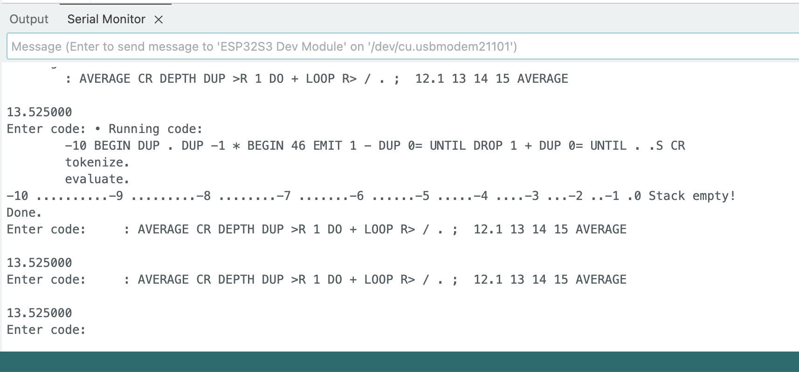

# ddForth

A minimal implementation of the Forth language in (mostly) C++. When I was a kid – a looooong time ago: the book I still have is based on FORTH-79... – I was fascinated by Forth, and RPN in general. I tried a few times, with various (lack of) success to write my own. Recently I decided to give it another go.

Surprisingly, it went well, beyond expectations, and I can run quite a few of the examples in my book. So I decided to keep pushing. I runs on my computer, as they say, which happens to be a Macbook Pro with an Apple M4 Pro CPU (and a 2018 Mac Mini Intel Core 7!). The compiled binary is small (110 KB on ARM, 85 KB on Intel).

Run `./ddforth "WORDS"` to get the list of words that have been implemented.

```
Handled in Code:
----------------
 • VAR         (Handled in code)
 • CONST       (Handled in code)
 • : ... ;     (Handled in code)

Native Commands:
----------------
WORDS + - * / FACT MOD SQR SQRT EMIT KEY . ." U. DUP DROP SWAP DEPTH ROT OVER BASE BIN DEC HEX ! @ CR .S .V = < <= > >= <> BEGIN UNTIL WHILE DO LOOP I I' J 

User Commands:
--------------
 • 0=          0 =
 • 0>          0 >
 • 0<          0 <
 • TRUE        1 =
 • FALSE       0 =
 • ?           @ .
 • 1+          1 +
 • 1-          1 -
 • 2+          2 +
 • 2-          2 -
 • 2*          2 *
 • 2/          2 /
```

## REGULAR VERSION


```forth
> make clean; make
rm -f ddforth ddforth_debug
g++ -O3 ddforth.cpp -o ddforth
> ./tests.sh
./ddforth -f test.fs
Read: ." \"中文也行\"" CR ." ¥Á¥!" size: 5
"中文也行" 
¥Á¥! 

./ddforth -f test01.fs

Read: CR ." OUTSIDE LOOP" CR size: 4
Read: -10 BEGIN size: 6
Read:   DUP . DUP -1 * CR size: 12

Read:   ." > INSIDE LOOP" CR size: 15
Read:   BEGIN size: 16
Read:     46 EMIT 1 - DUP 0= size: 22
Read:   UNTIL size: 23
Read:   DROP CR size: 25
Read:   1 + DUP size: 28
Read:   0= size: 29
Read: UNTIL size: 30
Read: . .S CR size: 33

OUTSIDE LOOP 
-10 
> INSIDE LOOP 
..........
-9 
> INSIDE LOOP 
.........
-8 
> INSIDE LOOP 
........
-7 
> INSIDE LOOP 
.......
-6 
> INSIDE LOOP 
......
-5 
> INSIDE LOOP 
.....
-4 
> INSIDE LOOP 
....
-3 
> INSIDE LOOP 
...
-2 
> INSIDE LOOP 
..
-1 
> INSIDE LOOP 
.
0 Stack empty! 


./ddforth -f test02.fs
Read: BASE .S 16 ! A5 BASE A ! . CR -13 DUP DUP .S . U. HEX . DEC CR BASE ? .V CR size: 24

	dataStack.size()	1	myInts	1	myFloats	0	myStrings	0
+-----------------------+
| 0	| INT.	| 0	|
+------------------------+
165 

	dataStack.size()	3	myInts	3	myFloats	0	myStrings	0
+-----------------------+
| 0	| INT.	| -13	|
| 1	| INT.	| -13	|
| 2	| INT.	| -13	|
+------------------------+
-13 4294967283 fffffff3 
10 myVARs.size: 2 myFVARs.size: 0 varAddresses.size: 2 fvarAddresses.size: 0
myCONSTs.size: 0 myFCONSTs.size: 0 constAddresses.size: 0 fconstAddresses.size: 0
+-----------------------------------------+
| Num     |  VAR Name   | Addr | Value    |
+-----------------------------------------+
|   0/2   | BASE        |    0 |       10 |
|   1/2   | VER.        |    1 |     1045 |
+-----------------------------------------+


./ddforth -f test03.fs

Read: 1 2 OVER 1.2 2.1 OVER .S ." Loop and add" CR BEGIN DUP . + DEPTH 1 = UNTIL . CR .S size: 21

	dataStack.size()	6	myInts	3	myFloats	3	myStrings	0
+-----------------------+
| 0	| FLOAT	| 1.200	|
| 1	| FLOAT	| 2.100	|
| 2	| FLOAT	| 1.200	|
| 3	| INT.	| 1	|
| 4	| INT.	| 2	|
| 5	| INT.	| 1	|
+------------------------+
Loop and add 
1.200000 3.300000 4.500000 5.500000 7.500000 8.500000 
Stack empty! 

./ddforth -f test04.fs


Read: ." Fact\x7e\t\x7eTest" CR 3 BEGIN DUP DUP . ." ! =" FACT U. CR 1 + DUP 10 = UNTIL CR size: 20
Fact~	~Test 
3 ! = 6 
4 ! = 24 
5 ! = 120 
6 ! = 720 
7 ! = 5040 
8 ! = 40320 
9 ! = 362880 


./ddforth -f test05.fs
Read: -10 BEGIN DUP . DUP -1 * BEGIN 46 EMIT 1 - DUP 0= UNTIL DROP 1 + DUP 0= UNTIL . .S CR size: 24
-10 ..........-9 .........-8 ........-7 .......-6 ......-5 .....-4 ....-3 ...-2 ..-1 .0 Stack empty! 


./ddforth -f test06.fs
Read: : ++ + + ; 1 1 1 .S ++ . CR size: 12

	dataStack.size()	3	myInts	3	myFloats	0	myStrings	0
+-----------------------+
| 0	| INT.	| 1	|
| 1	| INT.	| 1	|
| 2	| INT.	| 1	|
+------------------------+
3 


./ddforth -f test07.fs
Read: 11 CONST TAGADA 12 VAR TOGODO TOGODO TAGADA .S @ 3 + ! TOGODO ? CR size: 16

	dataStack.size()	2	myInts	2	myFloats	0	myStrings	0
+-----------------------+
| 0	| INT.	| 256	|
| 1	| INT.	| 2	|
+------------------------+
14 


./ddforth -f test08.fs
Read: 12 CONST GEG size: 3
Read: 31 VAR GUG size: 6
Read: 21.21 VAR GOG size: 9
Read: 12.12 CONST GAG size: 12
Read: .V size: 13
Read: GOG size: 14
Read: GAG @ GOG @ + size: 19
Read: .S size: 20
Read: ! size: 21
Read: .S size: 22
Read: .V size: 23
Read: GOG ? CR size: 26
myVARs.size: 3 myFVARs.size: 1 varAddresses.size: 3 fvarAddresses.size: 1
myCONSTs.size: 1 myFCONSTs.size: 1 constAddresses.size: 1 fconstAddresses.size: 1
+-----------------------------------------+
| Num     |  VAR Name   | Addr | Value    |
+-----------------------------------------+
|   0/3   | BASE        |    0 |       10 |
|   1/3   | GUG         |    2 |       31 |
|   2/3   | VER.        |    1 |     1045 |
+-----------------------------------------+
+-----------------------------------------+
| Num     | FVAR Name   | Addr | Value    |
+-----------------------------------------+
|   0/1   | GOG         |  128 |21.209999 |
+-----------------------------------------+
+-----------------------------------------+
| Num     |  CONST Name | Addr | Value    |
+-----------------------------------------+
|   0/1   | GEG         |  256 |       12 |
+-----------------------------------------+
+-----------------------------------------+
| Num     | FCONST Name | Addr | Value    |
+-----------------------------------------+
|   0/1   | GAG         |  384 |12.120000 |
+-----------------------------------------+

	dataStack.size()	2	myInts	1	myFloats	1	myStrings	0
+-----------------------+
| 0	| FLOAT	| 33.330	|
| 1	| INT.	| 128	|
+------------------------+
Stack empty! myVARs.size: 3 myFVARs.size: 1 varAddresses.size: 3 fvarAddresses.size: 1
myCONSTs.size: 1 myFCONSTs.size: 1 constAddresses.size: 1 fconstAddresses.size: 1
+-----------------------------------------+
| Num     |  VAR Name   | Addr | Value    |
+-----------------------------------------+
|   0/3   | BASE        |    0 |       10 |
|   1/3   | GUG         |    2 |       31 |
|   2/3   | VER.        |    1 |     1045 |
+-----------------------------------------+
+-----------------------------------------+
| Num     | FVAR Name   | Addr | Value    |
+-----------------------------------------+
|   0/1   | GOG         |  128 |33.329998 |
+-----------------------------------------+
+-----------------------------------------+
| Num     |  CONST Name | Addr | Value    |
+-----------------------------------------+
|   0/1   | GEG         |  256 |       12 |
+-----------------------------------------+
+-----------------------------------------+
| Num     | FCONST Name | Addr | Value    |
+-----------------------------------------+
|   0/1   | GAG         |  384 |12.120000 |
+-----------------------------------------+
33.329998 


./ddforth -f test09.fs
Read: -10 BEGIN size: 2
Read:   DUP . DUP -1 * size: 7
Read:   BEGIN size: 8
Read:     46 EMIT 1 - DUP size: 13
Read:     0= size: 14
Read:   UNTIL size: 15
Read:   DROP 1 + DUP size: 19
Read:   0= size: 20
Read: UNTIL size: 21
Read: . .S CR size: 24
-10 ..........-9 .........-8 ........-7 .......-6 ......-5 .....-4 ....-3 ...-2 ..-1 .0 Stack empty! 


./ddforth -f test10.fs
Read: 0 10 0 DO size: 4
Read:   DUP . size: 6

Read:   ." ===> " size: 8
Read:   1 + DUP DUP 10 SWAP size: 14
Read:   DO size: 15
Read:     DUP . 1 + size: 19
Read:   LOOP size: 20
Read:   DROP CR size: 22
Read: LOOP size: 23
0 ===>  1 2 3 4 5 6 7 8 9 
1 ===>  2 3 4 5 6 7 8 9 
2 ===>  3 4 5 6 7 8 9 
3 ===>  4 5 6 7 8 9 
4 ===>  5 6 7 8 9 
5 ===>  6 7 8 9 
6 ===>  7 8 9 
7 ===>  8 9 
8 ===>  9 
9 ===>  10 


./ddforth -f test11.fs
Read: CR 5 0 DO size: 4
Read:   I . 5 0 size: 8
Read:   DO size: 9
Read:     I . size: 11
Read:   LOOP size: 12
Read:   CR size: 13
Read: LOOP size: 14

0 0 1 2 3 4 
1 0 1 2 3 4 
2 0 1 2 3 4 
3 0 1 2 3 4 
4 0 1 2 3 4 


./ddforth -f test12.fs
Read: : AVERAGE chunks: 2
Read: CR DEPTH DUP >R chunks: 6
Read: 1 DO + LOOP chunks: 10
Read: R> / . chunks: 13
Read: ; chunks: 14
Read:  chunks: 14
Read: 12.1 13 14 15 AVERAGE chunks: 19

13.525000 

./ddforth -f test13.fs
Read: : AVERAGE chunks: 2
Read: CR DEPTH DUP VAR COUNT chunks: 7
Read: 1 DO + LOOP chunks: 11
Read: COUNT @ / . chunks: 15
Read: ; chunks: 16
Read:  chunks: 16

Read: LINE EXEC ." Average is: " AVERAGE chunks: 21
12 15 99 66
12 15 99 66
Average is:  
48 

```

## DEBUG VERSION

(TL,DR: Boring stuff, See [debug_log.txt](debug_log.txt))

```sh
for x in `ls test*fs`;do;echo "./ddforth_debug  -f $x";./ddforth_debug  -f $x;done > debug_log.txt 
```

## IoT version


