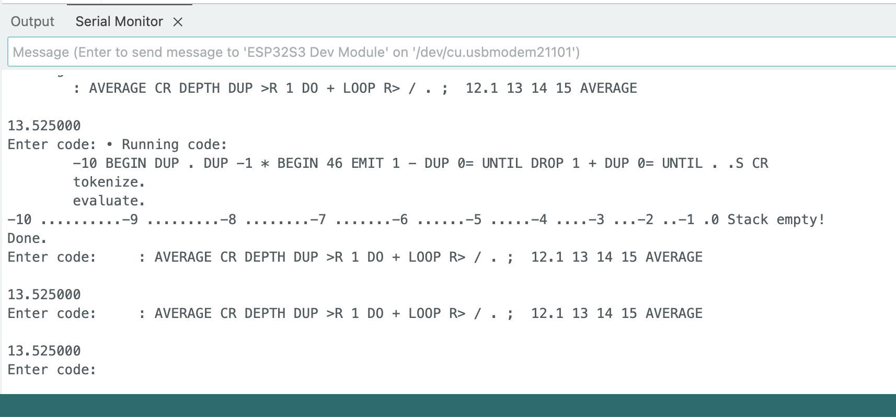
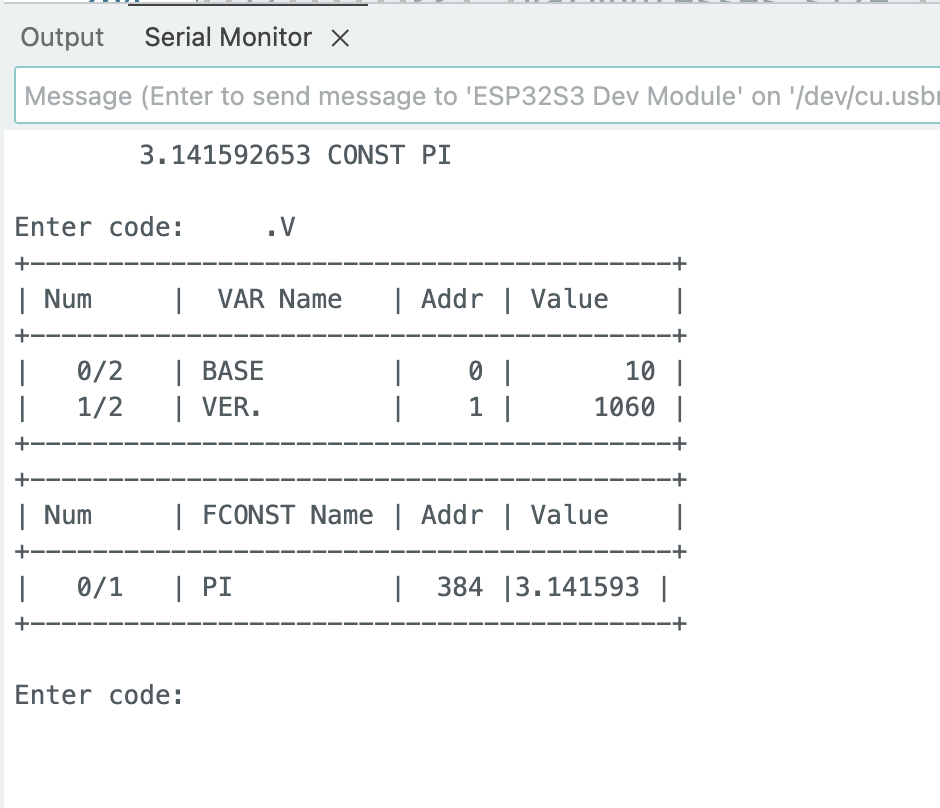

# ddForth

A minimal implementation of the Forth language in (mostly) C++. When I was a kid – a looooong time ago: the book I still have is based on FORTH-79... – I was fascinated by Forth, and RPN in general. I tried a few times, with various (lack of) success to write my own. Recently I decided to give it another go.

Surprisingly, it went well, beyond expectations, and I can run quite a few of the examples in my book. So I decided to keep pushing. I runs on my computer, as they say, which happens to be a Macbook Pro with an Apple M4 Pro CPU (and a 2018 Mac Mini Intel Core 7!). The compiled binary is still quite small (260 KB on ARM).

The original README was outdated, and possibly confusing. I am trying to rewrite it so that it helps you start with ddForth without losing too much hair. For the language itself, and especially this dialect of Forth, which has a strong accent... see the [Tutorial](Tutorial.md).

## Various versions

Until a while ago I tried developing the main version alongside with:

* An SDL version;
* Various IOT versions, including:
	* A Pico version;
	* A CardPuter version;
	* A couple of esp32 versions
* An IPC socket-based GUI version, which might work out better than the SDL version. But development has been suspended for now.

These are terribly outdated now, and should not be used, really. I will probably make a backup, and remove them from the repo.

## INSTALLING

A bunch of subversions ago, I launched a plugin system, which seems to work well. The development directory is called `plugin`, no surprise here. However, compiled plugins go into `~/.ddForthPlugins/` – at least on Linux and Mac OS X. No idea how to do that on Windows.

Read the plugin directory's [README](plugin/README.md) to build the plugins properly, which you will need to do before building ddForth proper.

### Compiling

```sh~/ddForth$ make install
mkdir -p bin
g++ -O3 -c ddforth.cpp -o bin/ddforth.o
g++ -o bin/ddforth bin/ddforth.o -lcurl
#rm -f bin/*.o
sudo cp bin/ddforth /usr/local/bin/
mkdir -p ~/.ddForthPlugins
cp ./plugin/*.so ~/.ddForthPlugins/
ls -al ~/.ddForthPlugins/
total 2356
drwxrwxr-x  2 kongduino kongduino    4096 Nov  1 14:32 .
drwxr-xr-x 19 kongduino kongduino    4096 Nov  1 15:16 ..
-rwxrwxr-x  1 kongduino kongduino  412944 Nov  1 15:17 ls.so
-rwxrwxr-x  1 kongduino kongduino 1987704 Nov  1 15:17 traversin.so
```

On Linux you might get some (harmless) warnings – I will work on removing them (by solving the issue!). The plugins are copied to `~/.ddForthPlugins/` (which will be created if it doesn't exist yet). This is where ddForth will look for them. Calling a non-existent plugin crashes hard (punishment!) but this will change too.

### Launching

`make install` copies ddForth to `/usr/local/bin/` so it should be available right away:

```sh
$ ddforth 
ddForth v1.2.91


OK 
```

Generally, when code fails, the interpreter tries to be helpful, and shows context (a couple of words before and after the culprit) and the stack – before nuking it. Example:


```
OK s" This is a string" s" \ " splitd 5 strpick cs cr
handleSPICK/2 Stack overflow!
strpick returned false. Aborting!

CONTEXT: 4 to 9
        splitd 5 strpick cs cr         

+-----------------------+
| 0	| INT.	| 4         |
| 1	| STR.	| string	|
| 2	| STR.	| a	        |
| 3	| STR.	| is	    |
| 4	| STR.	| This	    |
+-----------------------+
OK 
```

Yeah dude, there are only 4 chunks...

See the [Tutorial](Tutorial.md), which needs an upgrade, too, and the `tests` directory. There are close to 50 examples so far.


```
	.V WORDS

+-----------------------------------------+
| Num     |  VAR Name   | Addr | Value    |
+-----------------------------------------+
|   0/2   | BASE        |    0 |       10 |
|   1/2   | VER.        |    1 |     1156 |
+-----------------------------------------+
+-----------------------------------------+
| Num     | FCONST Name | Addr | Value    |
+-----------------------------------------+
|   0/2   | E           |  385 | 2.718282 |
|   1/2   | PI          |  384 | 3.141593 |
+-----------------------------------------+
Handled in Code:
----------------
 • VAR         (Handled in code)
 • CONST       (Handled in code)
 • : ... ;     (Handled in code)
 • IF...THEN...ELSE (Handled in code)
 • ( THIS IS A COMMENT. ) (Handled in code)

Native Commands:
----------------
WORDS HELP HELP" + - * / ABS MIN MAX FACT MOD AND OR XOR NOT NEGATE INVERT
SQR SQRT SIN COS TAN ASIN ACOS ATAN SINH COSH TANH LOG LOG10 ROUND FLOOR
CEIL EXP INT EMIT CHR KEY LINE U. ." S" C" . CS +STR STR+ LEFTSTR MIDSTR
RIGHTSTR LENSTR SUBSTR LOWERSTR UPPERSTR MULTSTR STRIPSTR LSTRIPSTR
RSTRIPSTR INTSTR STRINT STRFLOAT CSPLIT SPLITD SREVERSE DINSERT STRREPLACE
VARRAY DUP DROP SWAP DEPTH CLEAR ROT ROLL OVER STRPICK STRSTORE STRJOIN
PICK BASE BIN DEC HEX ! !+ @ CR .S .V = S= < <= > >= <> =? >? <? <=? >=?
<>? BEGIN UNTIL WHILE DO LOOP +LOOP I I' J >R R> EXEC FLOAD FSAVE UOPEN
UREADL UFLUSH UDISCARDUNTIL UREADUNTIL UREADC UCLOSE RANDOM RANDOMI IF THEN
ELSE EXIT ( ARRAY ARRAYS >IX IX> LEN> IX+ +IX <ROT ROT> ALIST ASUM POSXY
CLEAN SLEEP 

User Commands:
--------------
 • 0=          0 =
 • 0>          0 >
 • 0<          0 <
 • TRUE        1 =
 • FALSE       0 =
 • ?           @ .
 • 1+          1 +
 • 1-          1 -
 • 2+          2 +
 • 2-          2 -
 • 2*          2 *
 • 2/          2 /
 • pi          PI @
 • ++          + +
 • NIP         SWAP DROP
 • TUCK        SWAP OVER
 • -ROT        ROT ROT
 • nip         swap drop
 • tuck        swap over
 • -rot        rot rot
 • true        1 =
 • false       0 =
 • nROT>       0 DO DUP ROT> LOOP CLEAR
 • n<ROT       0 DO DUP <ROT LOOP CLEAR
 • ssplit      32 csplit
 • SSPLIT      32 CSPLIT
OK 
OK help" sleep"
Looking for SLEEP
SLEEP          : ( n -- ) Sleeps for n seconds.
```

## REGULAR VERSION


```forth
> make clean; make
rm -f ddforth ddforth_debug
g++ -O3 ddforth.cpp -o ddforth
> cd tests
> ./tests.sh
./tests.sh
./ddforth -e test00.fs
ddForth v1.1.54
 • Read: ." \"中文也行\"" CR ." ¥Á¥!"
Read: 1 line, chunks: 5
"中文也行"
¥Á¥!

OK ./ddforth -e test01.fs
ddForth v1.1.54
 • Read: ( testing imbricated DO...LOOP with EMIT )
 • Read: CR ." OUTSIDE LOOP" CR
 • Read: -10 BEGIN
 • Read:   DUP . DUP -1 * CR
 • Read:   ." > INSIDE LOOP" CR
 • Read:   BEGIN
 • Read:     46 EMIT 1 - DUP 0=
 • Read:   UNTIL
 • Read:   DROP CR
 • Read:   1 + DUP
 • Read:   0=
 • Read: UNTIL
 • Read: . STACK CR
Read: 13 lines, chunks: 40

OUTSIDE LOOP
-10
> INSIDE LOOP
..........
-9
> INSIDE LOOP
.........
-8
> INSIDE LOOP
........
-7
> INSIDE LOOP
.......
-6
> INSIDE LOOP
......
-5
> INSIDE LOOP
.....
-4
> INSIDE LOOP
....
-3
> INSIDE LOOP
...
-2
> INSIDE LOOP
..
-1
> INSIDE LOOP
.
0 Stack empty!


OK ./ddforth -e test02.fs
ddForth v1.1.54
 • Read: BASE 16 !
 • Read: A5 BASE A ! . CR
 • Read: -13 DUP DUP STACK
 • Read: . U.
 • Read: HEX .
 • Read: DEC CR
 • Read: BASE ? .V CR
Read: 7 lines, chunks: 23
165

+-----------------------+
| 0	| INT.	| -13	|
| 1	| INT.	| -13	|
| 2	| INT.	| -13	|
+-----------------------+
-13 4294967283 fffffff3
10
+-----------------------------------------+
| Num     |  VAR Name   | Addr | Value    |
+-----------------------------------------+
|   0/2   | BASE        |    0 |       10 |
|   1/2   | VER.        |    1 |     1154 |
+-----------------------------------------+
+-----------------------------------------+
| Num     | FCONST Name | Addr | Value    |
+-----------------------------------------+
|   0/2   | E           |  385 | 2.718282 |
|   1/2   | PI          |  384 | 3.141593 |
+-----------------------------------------+


OK ./ddforth -e test03.fs
ddForth v1.1.54
 • Read: 1 2 OVER 1.2 2.1 OVER STACK
 • Read: ." Loop and add" CR
 • Read: BEGIN
 • Read:   DUP . +
 • Read:   DEPTH 1 =
 • Read: UNTIL
 • Read: . CR STACK
Read: 7 lines, chunks: 21

+-----------------------+
| 0	| FLOAT	| 1.200	    |
| 1	| FLOAT	| 2.100	    |
| 2	| FLOAT	| 1.200	    |
| 3	| INT.	| 1	        |
| 4	| INT.	| 2	        |
| 5	| INT.	| 1	        |
+-----------------------+
Loop and add
1.200000 3.300000 4.500000 5.500000 7.500000 8.500000
Stack empty!

OK ./ddforth -e test04.fs
ddForth v1.1.54
 • Read: ." Fact\x7e\t\x7eTest" CR
 • Read: 3 BEGIN
 • Read:   DUP DUP .
 • Read:   ." ! ="
 • Read:   FACT U. CR
 • Read:   1 + DUP 10 =
 • Read: UNTIL CR
Read: 7 lines, chunks: 20
Fact~	~Test
3 ! =6
4 ! =24
5 ! =120
6 ! =720
7 ! =5040
8 ! =40320
9 ! =362880


OK ./ddforth -e test05.fs
ddForth v1.1.54
 • Read: -10 BEGIN
 • Read:   DUP . DUP -1 *
 • Read:   BEGIN
 • Read:     46 EMIT 1 - DUP
 • Read:     0=
 • Read:   UNTIL
 • Read:   DROP
 • Read:   1 + DUP
 • Read:   0=
 • Read: UNTIL
 • Read: . STACK CR
Read: 11 lines, chunks: 24
-10 ..........-9 .........-8 ........-7 .......-6 ......-5 .....-4 ....-3 ...-2 ..-1 .0 Stack empty!


OK ./ddforth -e test06.fs
ddForth v1.1.54
 • Read: : ++ + + ; 1 1 1 STACK ++ . CR
Read: 1 line, chunks: 12

+-----------------------+
| 0	| INT.	| 1	|
| 1	| INT.	| 1	|
| 2	| INT.	| 1	|
+-----------------------+
3


OK ./ddforth -e test07.fs
ddForth v1.1.54
 • Read: 11 CONST TAGADA
 • Read: 12 VAR TOGODO
 • Read: TOGODO TAGADA STACK @ 3 + !
 • Read: TOGODO ? CR
Read: 4 lines, chunks: 16

+-----------------------+
| 0	| INT.	| 256	    |
| 1	| INT.	| 2	        |
+-----------------------+
14


OK ./ddforth -e test08.fs
ddForth v1.1.54
 • Read: 12 CONST GEG
 • Read: 31 VAR GUG
 • Read: 21.21 VAR GOG
 • Read: 12.12 CONST GAG
 • Read: .V
 • Read: GOG
 • Read: GAG @ GOG @ +
 • Read: STACK
 • Read: !
 • Read: STACK
 • Read: .V
 • Read: GOG ? CR
Read: 12 lines, chunks: 26

+-----------------------------------------+
| Num     |  VAR Name   | Addr | Value    |
+-----------------------------------------+
|   0/3   | BASE        |    0 |       10 |
|   1/3   | GUG         |    2 |       31 |
|   2/3   | VER.        |    1 |     1154 |
+-----------------------------------------+
+-----------------------------------------+
| Num     | FVAR Name   | Addr | Value    |
+-----------------------------------------+
|   0/1   | GOG         |  128 |21.209999 |
+-----------------------------------------+
+-----------------------------------------+
| Num     |  CONST Name | Addr | Value    |
+-----------------------------------------+
|   0/1   | GEG         |  256 |       12 |
+-----------------------------------------+
+-----------------------------------------+
| Num     | FCONST Name | Addr | Value    |
+-----------------------------------------+
|   0/3   | E           |  385 | 2.718282 |
|   1/3   | GAG         |  386 |12.120000 |
|   2/3   | PI          |  384 | 3.141593 |
+-----------------------------------------+

+-----------------------+
| 0	| FLOAT	| 33.330	|
| 1	| INT.	| 128	|
+-----------------------+
Stack empty!
+-----------------------------------------+
| Num     |  VAR Name   | Addr | Value    |
+-----------------------------------------+
|   0/3   | BASE        |    0 |       10 |
|   1/3   | GUG         |    2 |       31 |
|   2/3   | VER.        |    1 |     1154 |
+-----------------------------------------+
+-----------------------------------------+
| Num     | FVAR Name   | Addr | Value    |
+-----------------------------------------+
|   0/1   | GOG         |  128 |33.329998 |
+-----------------------------------------+
+-----------------------------------------+
| Num     |  CONST Name | Addr | Value    |
+-----------------------------------------+
|   0/1   | GEG         |  256 |       12 |
+-----------------------------------------+
+-----------------------------------------+
| Num     | FCONST Name | Addr | Value    |
+-----------------------------------------+
|   0/3   | E           |  385 | 2.718282 |
|   1/3   | GAG         |  386 |12.120000 |
|   2/3   | PI          |  384 | 3.141593 |
+-----------------------------------------+
33.329998


OK ./ddforth -e test09.fs
ddForth v1.1.54
 • Read: -10 BEGIN
 • Read:   DUP . DUP -1 *
 • Read:   BEGIN
 • Read:     46 EMIT 1 - DUP
 • Read:     0=
 • Read:   UNTIL
 • Read:   DROP 1 + DUP
 • Read:   0=
 • Read: UNTIL
 • Read: . STACK CR
Read: 10 lines, chunks: 24
-10 ..........-9 .........-8 ........-7 .......-6 ......-5 .....-4 ....-3 ...-2 ..-1 .0 Stack empty!


OK ./ddforth -e test10.fs
ddForth v1.1.54
 • Read: 0 10 0 DO
 • Read:   DUP .
 • Read:   ." ===> "
 • Read:   1 + DUP DUP 10 SWAP
 • Read:   DO
 • Read:     DUP . 1 +
 • Read:   LOOP
 • Read:   DROP CR
 • Read: LOOP
Read: 9 lines, chunks: 23
0 ===> 1 2 3 4 5 6 7 8 9
1 ===> 2 3 4 5 6 7 8 9
2 ===> 3 4 5 6 7 8 9
3 ===> 4 5 6 7 8 9
4 ===> 5 6 7 8 9
5 ===> 6 7 8 9
6 ===> 7 8 9
7 ===> 8 9
8 ===> 9
9 ===> 10


OK ./ddforth -e test11.fs
ddForth v1.1.54
 • Read: CR 5 0 DO
 • Read:   I . 5 0
 • Read:   DO
 • Read:     I .
 • Read:   LOOP
 • Read:   CR
 • Read: LOOP
Read: 7 lines, chunks: 14

0 0 1 2 3 4
1 0 1 2 3 4
2 0 1 2 3 4
3 0 1 2 3 4
4 0 1 2 3 4


OK ./ddforth -e test12.fs
ddForth v1.1.54
 • Read: : AVERAGE
 • Read: CR DEPTH DUP >R
 • Read: 1 DO + LOOP
 • Read: R> / .
 • Read: ;
 • Read:
 • Read: 12.1 13 14 15 AVERAGE
Read: 7 lines, chunks: 19

0.073937

OK ./ddforth -e test13.fs
ddForth v1.1.54
 • Read: ( Create a word called average )
 • Read: : AVERAGE
 • Read: CR DEPTH DUP VAR COUNT (assign depth as variable COUNT)
 • Read: 1 DO + LOOP (sum up all numbers)
 • Read: COUNT @ / . (calculate average and print)
 • Read: ;
 • Read: ." Please enter numbers, separated by spaces, to average out:" CR
 • Read: LINE EXEC ." Average: " AVERAGE
Read: 8 lines, chunks: 44
Please enter numbers, separated by spaces, to average out:
1 2 3 4 5 6
1 2 3 4 5 6
Average:

ERROR! Unknown: (assign at executionPointer 5


OK ./ddforth -e test14.fs
ddForth v1.1.54
 • Read: s" Hello!" LENSTR 0 DO 0 I 1 + SUBSTR .s CR LOOP CLEAR CR
 • Read: s" Hello!" LENSTR 0 DO LENSTR 1 - I - MIDSTR EMIT LOOP CLEAR CR
 • Read: s" Hello!" s" (123)" +STR s" (456)" STR+ .s CLEAR CR
 • Read: s" HeLlO" DUP DUP ." Original string: " .s CR ." UPPERCASE: " UPPERSTR .s CR ." lowercase: " LOWERSTR .s CR
 • Read: s" +..." DUP ." Stack " .s RANDOM 10 MOD 1 + DUP . ." times as a string, add a + at the end and print:" CR MULTSTR s" +" STR+ .s CR
 • Read: s" \tfff  " DUP .s 9 . CR LSTRIPSTR DUP .s 10 . CR RSTRIPSTR .s 11 . CR
 • Read: s" \tfff  " DUP .s 0 . CR STRIPSTR DUP .s 0 . CR
 • Read: 10 0 DO s" Ligne n° " I INTSTR STR+ .s CR LOOP
 • Read: s" 10" STRINT 10 + . CR
Read: 9 lines, chunks: 130
H
He
Hel
Hell
Hello
Hello!

!olleH
(123)Hello!(456)
Original string: HeLlO
UPPERCASE: HELLO
lowercase: hello
Stack +...2 times as a string, add a + at the end and print:
+...+...+
	fff  9
fff  10
fff11
	fff  0
fff0
Ligne n° 0
Ligne n° 1
Ligne n° 2
Ligne n° 3
Ligne n° 4
Ligne n° 5
Ligne n° 6
Ligne n° 7
Ligne n° 8
Ligne n° 9
20


OK ./ddforth -e test15.fs
ddForth v1.1.54
 • Read: ." is 10 = 10? "
 • Read: 10 10 = IF ." True" THEN ." False" ELSE CR
 • Read: ." is 10 = 11? "
 • Read: 10 11 = IF ." True" THEN ." False" ELSE CR
Read: 4 lines, chunks: 26
is 10 = 10? True
is 10 = 11? False


OK ./ddforth -e test16.fs
ddForth v1.1.54
 • Read: : fx DUP 1 >  IF DUP 1 - fx * THEN ELSE ;
 • Read: 12 3 DO I fx . LOOP CR
 • Read: 12 1 DO
 • Read:   s" ." I' I 1 + - MULTSTR .s
 • Read:   I DUP INTSTR .s ." ! = " fx . CR
 • Read: LOOP CR
Read: 6 lines, chunks: 45
6 24 120 720 5040 40320 362880 3628800 39916800

ERROR! Unknown: I' at executionPointer 27


OK ./ddforth -e test17.fs
ddForth v1.1.54
 • Read: PI ? E ? 1 EXP . CR
 • Read: .V
 • Read:
Read: 3 lines, chunks: 9
3.141593 2.718282 2.718282

+-----------------------------------------+
| Num     |  VAR Name   | Addr | Value    |
+-----------------------------------------+
|   0/2   | BASE        |    0 |       10 |
|   1/2   | VER.        |    1 |     1154 |
+-----------------------------------------+
+-----------------------------------------+
| Num     | FCONST Name | Addr | Value    |
+-----------------------------------------+
|   0/2   | E           |  385 | 2.718282 |
|   1/2   | PI          |  384 | 3.141593 |
+-----------------------------------------+


OK ./ddforth -e test18.fs
ddForth v1.1.54
 • Read: : xx 15 >? . S IF DROP 15 THEN 12 =? IF DROP 21 THEN ELSE ELSE ;
 • Read:
 • Read: 2  xx .
 • Read: 19 xx .
 • Read: 12 xx .
Read: 5 lines, chunks: 28
0
ERROR! Unknown: S at executionPointer 3
2 1
ERROR! Unknown: S at executionPointer 3
19 0
ERROR! Unknown: S at executionPointer 3
12

OK ./ddforth -e test19.fs
ddForth v1.1.54
 • Read: 0 10 array STACK
 • Read: 10 0 DO I 1 + 2 * i >ix loop STACK
 • Read: 10 0 DO I ix> 2 / i >ix loop STACK
Read: 3 lines, chunks: 27
array returned false. Aborting!


OK ./ddforth -e test20.fs
ddForth v1.1.54
 • Read: : showTagada s" tagada" LEN> 0 do I dup ." cell " . ." = " s" tagada" IX> . cr LOOP CR ;
 • Read: 1 10 s" tagada" array CR ( create an INT array of 10 cells, value 1 )
 • Read: showTagada
 • Read: 10 0 do I I s" tagada" >IX LOOP  CR
 • Read: showTagada
 • Read: 10 0 do I 2 * I s" tagada" >IX LOOP  CR
 • Read: showTagada
 • Read: 33 s" tagada" IX+ 11 s" tagada" +IX
 • Read: showTagada
 • Read: 1 10 s" TT" array s" TT" alist 13 3 s" TT" >IX 3 s" TT" IX> . CR s" TT" alist CR
 • Read: ." <ROT Left rot, ie UP, x 3:" CR
 • Read: s" TT" 3 n<ROT s" TT" alist CR
 • Read: ." ROT> Right rot, ie DOWN, x 6:" CR
 • Read: s" TT" 6 nROT>
 • Read: s" TT" alist
Read: 15 lines, chunks: 117

cell 0 = 1
cell 1 = 1
cell 2 = 1
cell 3 = 1
cell 4 = 1
cell 5 = 1
cell 6 = 1
cell 7 = 1
cell 8 = 1
cell 9 = 1


cell 0 = 0
cell 1 = 1
cell 2 = 2
cell 3 = 3
cell 4 = 4
cell 5 = 5
cell 6 = 6
cell 7 = 7
cell 8 = 8
cell 9 = 9


cell 0 = 0
cell 1 = 2
cell 2 = 4
cell 3 = 6
cell 4 = 8
cell 5 = 10
cell 6 = 12
cell 7 = 14
cell 8 = 16
cell 9 = 18

cell 0 = 11
cell 1 = 0
cell 2 = 2
cell 3 = 4
cell 4 = 6
cell 5 = 8
cell 6 = 10
cell 7 = 12
cell 8 = 14
cell 9 = 16
cell 10 = 18
cell 11 = 33

Cell #0: 1
Cell #1: 1
Cell #2: 1
Cell #3: 1
Cell #4: 1
Cell #5: 1
Cell #6: 1
Cell #7: 1
Cell #8: 1
Cell #9: 1
13
Cell #0: 1
Cell #1: 1
Cell #2: 1
Cell #3: 13
Cell #4: 1
Cell #5: 1
Cell #6: 1
Cell #7: 1
Cell #8: 1
Cell #9: 1

<ROT Left rot, ie UP, x 3:
Cell #0: 13
Cell #1: 1
Cell #2: 1
Cell #3: 1
Cell #4: 1
Cell #5: 1
Cell #6: 1
Cell #7: 1
Cell #8: 1
Cell #9: 1

ROT> Right rot, ie DOWN, x 6:
Cell #0: 1
Cell #1: 1
Cell #2: 1
Cell #3: 1
Cell #4: 1
Cell #5: 1
Cell #6: 13
Cell #7: 1
Cell #8: 1
Cell #9: 1


OK ./ddforth -e test21.fs
ddForth v1.1.54
 • Read: 0 10 s" TABLEAU" array
 • Read: ." Tableau:" cr
 • Read: 10 0 DO randomi 128 MOD I s" TABLEAU" >IX LOOP
 • Read: s" TABLEAU" alist
 • Read: : tableauAccu 0 DO I s" TABLEAU" IX> + LOOP ;
 • Read: 0 ( original total ) 5 ( number of "days" ) tableauAccu . CR
Read: 6 lines, chunks: 47
Tableau:
Cell #0: 125
Cell #1: 73
Cell #2: 76
Cell #3: 70
Cell #4: 49
Cell #5: 21
Cell #6: 36
Cell #7: 6
Cell #8: 2
Cell #9: 76
393


OK ./ddforth -e test22.fs
ddForth v1.1.54
 • Read: 0 10 s" TABLEAU" array
 • Read: ." Tableau:" cr
 • Read: 10 0 DO randomi 128 MOD I s" TABLEAU" >IX LOOP
 • Read: CR s" TABLEAU" alist
 • Read: : accumul VAR myarray 0 SWAP 0 DO I myarray @ IX> + LOOP ;
 • Read: 10 s" TABLEAU" accumul ." Total: " DUP . CR
 • Read: 5 s" TABLEAU" accumul ." Subtotal: " DUP . cr
 • Read: ." Remainder: " - . cr
Read: 8 lines, chunks: 61
Tableau:

Cell #0: 115
Cell #1: 53
Cell #2: 56
Cell #3: 119
Cell #4: 95
Cell #5: 1
Cell #6: 105
Cell #7: 51
Cell #8: 22
Cell #9: 101
Total: 718
Subtotal: 438
Remainder: 280


OK ./ddforth -e test23.fs
ddForth v1.1.54
 • Read: clear ." Split `"
 • Read: s" 1"
 • Read: 100 0 DO
 • Read:   RANDOM 10 MOD INTSTR
 • Read:   DUP .s
 • Read:   STR+
 • Read: LOOP
 • Read: ." ` by: "
 • Read: RANDOM 10 MOD
 • Read: DUP .
 • Read: INTSTR
 • Read: SPLITD
 • Read: CR DUP ." Pieces: " . CR
 • Read: 0 DO
 • Read:   ." * " .s cr
 • Read: LOOP
 • Read:
 • Read: 1 2 3 4 4 s" ints" VARRAY CR s" ints" alist
 • Read: 1.1 2.2 3.3 4.4 4 s" floats" VARRAY CR s" floats" alist
 • Read: s" un|deux|trois|quatre" s" |" SPLITD s" strings" VARRAY CR s" strings" alist
Read: 20 lines, chunks: 74
Split `8033902754976677404073491473782563057273704894103704892017389849974814791730163849275077472532400003` by: 7
Pieces: 20
* 2532400003
* 4
*
* 50
* 301638492
* 91
* 4814
* 3898499
* 0489201
* 04894103
* 3
* 2
* 8256305
* 3
* 34914
* 4040
*
* 66
* 549
* 18033902

Cell #0: 4
Cell #1: 3
Cell #2: 2
Cell #3: 1

Cell #0: 4.400000
Cell #1: 3.300000
Cell #2: 2.200000
Cell #3: 1.100000

Cell #0: quatre
Cell #1: trois
Cell #2: deux
Cell #3: un


OK ./ddforth -e test24.fs
ddForth v1.1.54
 • Read: clear s" Player3 Player2 Player1" SSPLIT s" Players" VARRAY
 • Read: s" Players" len> DUP . ." players" CR 0 DO 0 4 I s" Players" IX> array LOOP
 • Read: : SCORE s" Players" IX> >IX ;
 • Read: 0 0 0 3 s" Scores" VARRAY
 • Read: -1 VAR scoreGagnant
 • Read: -1 VAR gagnant
 • Read: 0 BEGIN
 • Read:   ." \ * Player " DUP 1 + .
 • Read:   4 0 DO
 • Read:     RANDOM 6 MOD OVER I SWAP SCORE
 • Read:   LOOP
 • Read:   DUP DUP s" Players" IX> ASUM ." Total score: " DUP DUP . CR
 • Read:   rot swap s" Scores" >IX
 • Read:   DUP scoreGagnant @ > IF
 • Read:     ( ." yes\ " ) scoreGagnant swap !
 • Read:     DUP gagnant swap !
 • Read:   then ( ." no\ " ) drop else
 • Read:   1 + DUP 3 =
 • Read: UNTIL
 • Read: s" Player" gagnant @ 1 + INTSTR s" \ wins!" STR+ str+ .s CR CR
Read: 20 lines, chunks: 124
3 players
 * Player 1 Total score: 10
 * Player 2 Total score: 14
 * Player 3 Total score: 14
Player2 wins!


OK
```

## DEBUG VERSION

(TL,DR: Boring stuff, See [debug_log.txt](debug_log.txt))

```sh
for x in `ls test*fs`;do;echo "./ddforth_debug  -f $x";./ddforth_debug  -f $x;done > debug_log.txt
```

## IoT version






File `/data/t0.fs` loaded from SPIFFS.
