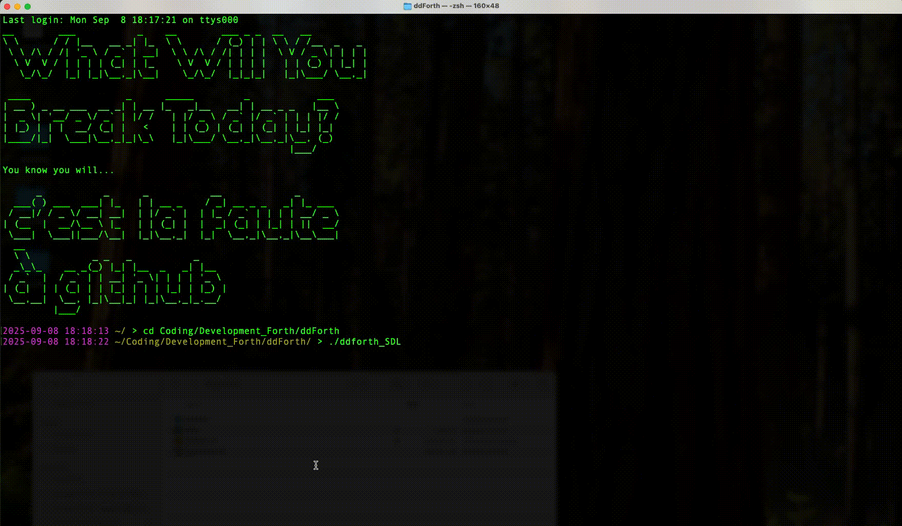

# ddForth

A minimal implementation of the Forth language in (mostly) C++. When I was a kid – a looooong time ago: the book I still have is based on FORTH-79... – I was fascinated by Forth, and RPN in general. I tried a few times, with various (lack of) success to write my own. Recently I decided to give it another go.

Surprisingly, it went well, beyond expectations, and I can run quite a few of the examples in my book. So I decided to keep pushing. I runs on my computer, as they say, which happens to be a Macbook Pro with an Apple M4 Pro CPU (and a 2018 Mac Mini Intel Core 7!). The compiled binary is small (110 KB on ARM, 85 KB on Intel).

Run `./ddforth "WORDS"` to get the list of words that have been implemented.

### NOTE

For IoT versions, you might need to edit the `platform.txt` file to remove `-fno-exceptions` and/or set `-fexceptions` in the `compiler.cpp.flags` section.

### Fonts

* [Roboto Mono](https://fonts.google.com/specimen/Roboto+Mono)
* [Roboto](https://fonts.google.com/specimen/Roboto)





```
	.V WORDS
+-----------------------------------------+
| Num     |  VAR Name   | Addr | Value    |
+-----------------------------------------+
|   0/2   | BASE        |    0 |       10 |
|   1/2   | VER.        |    1 |     1100 |
+-----------------------------------------+
+-----------------------------------------+
| Num     | FCONST Name | Addr | Value    |
+-----------------------------------------+
|   0/2   | E           |  385 | 2.718282 |
|   1/2   | PI          |  384 | 3.141593 |
+-----------------------------------------+
Handled in Code:
----------------
 • VAR         (Handled in code)
 • CONST       (Handled in code)
 • : ... ;     (Handled in code)

Native Commands:
----------------
WORDS + - * / ABS MIN MAX FACT MOD AND OR XOR NOT NEGATE INVERT SQR
SQRT SIN COS TAN ASIN ACOS ATAN SINH COSH TANH LOG LOG10 ROUND FLOOR
CEIL EXP INT EMIT KEY LINE . ." s" .s +STR STR+ LEFTSTR MIDSTR
RIGHTSTR LENSTR SUBSTR LOWERSTR UPPERSTR MULTSTR STRIPSTR
LSTRIPSTR RSTRIPSTR INTSTR STRINT U. DUP DROP SWAP DEPTH CLEAR ROT
ROLL OVER BASE BIN DEC HEX ! !+ @ CR .S .V = < <= > >= <> BEGIN
UNTIL WHILE DO LOOP I I' J >R R> EXEC LOAD RANDOM RANDOMI IF THEN
ELSE EXIT ( 

User Commands:
--------------
 • 0=          0 =
 • 0>          0 >
 • 0<          0 <
 • TRUE        1 =
 • FALSE       0 =
 • ?           @ .
 • 1+          1 +
 • 1-          1 -
 • 2+          2 +
 • 2-          2 -
 • 2*          2 *
 • 2/          2 /
 • pi          PI @
 • ++          + +
 • NIP         SWAP DROP
 • TUCK        SWAP OVER
 • -ROT        ROT ROT
```

## REGULAR VERSION


```forth
> make clean; make
rm -f ddforth ddforth_debug
g++ -O3 ddforth.cpp -o ddforth
> cd tests
> ./tests.sh
./ddforth -f test00.fs


Read: ." \"中文也行\"" CR ." ¥Á¥!" chunks: 5


"中文也行" 
¥Á¥! "中文也行" 
¥Á¥! 

./ddforth -f test01.fs

Read: CR ." OUTSIDE LOOP" CR chunks: 4
Read: -10 BEGIN chunks: 6
Read:   DUP . DUP -1 * CR chunks: 12

Read:   ." > INSIDE LOOP" CR chunks: 15
Read:   BEGIN chunks: 16
Read:     46 EMIT 1 - DUP 0= chunks: 22
Read:   UNTIL chunks: 23
Read:   DROP CR chunks: 25
Read:   1 + DUP chunks: 28
Read:   0= chunks: 29
Read: UNTIL chunks: 30
Read: . .S CR chunks: 33

OUTSIDELOOP 
-10 
>INSIDELOOP 
..........
-9 
>INSIDELOOP 
.........
-8 
>INSIDELOOP 
........
-7 
>INSIDELOOP 
.......
-6 
>INSIDELOOP 
......
-5 
>INSIDELOOP 
.....
-4 
>INSIDELOOP 
....
-3 
>INSIDELOOP 
...
-2 
>INSIDELOOP 
..
-1 
>INSIDELOOP 
.
0 Stack empty! 
. returned false. Aborting!


./ddforth -f test02.fs
Read: BASE 16 ! chunks: 3
Read: A5 BASE A ! . CR chunks: 9
Read: -13 DUP DUP .S chunks: 13
Read: . U. chunks: 15
Read: HEX . chunks: 17
Read: DEC CR chunks: 19
Read: BASE ? .V CR chunks: 23
165 

+-----------------------+
| 0	| INT.	| -13	|
| 1	| INT.	| -13	|
| 2	| INT.	| -13	|
+-----------------------+
-13 4294967283 fffffff3 
10 myVARs.size: 2 myFVARs.size: 0 varAddresses.size: 2 fvarAddresses.size: 0
myCONSTs.size: 0 myFCONSTs.size: 1 constAddresses.size: 0 fconstAddresses.size: 1
+-----------------------------------------+
| Num     |  VAR Name   | Addr | Value    |
+-----------------------------------------+
|   0/2   | BASE        |    0 |       10 |
|   1/2   | VER.        |    1 |     1098 |
+-----------------------------------------+
+-----------------------------------------+
| Num     | FCONST Name | Addr | Value    |
+-----------------------------------------+
|   0/1   | PI          |  384 |3.141593 |
+-----------------------------------------+

10 myVARs.size: 2 myFVARs.size: 0 varAddresses.size: 2 fvarAddresses.size: 0
myCONSTs.size: 0 myFCONSTs.size: 1 constAddresses.size: 0 fconstAddresses.size: 1
+-----------------------------------------+
| Num     |  VAR Name   | Addr | Value    |
+-----------------------------------------+
|   0/2   | BASE        |    0 |       10 |
|   1/2   | VER.        |    1 |     1098 |
+-----------------------------------------+
+-----------------------------------------+
| Num     | FCONST Name | Addr | Value    |
+-----------------------------------------+
|   0/1   | PI          |  384 |3.141593 |
+-----------------------------------------+


./ddforth -f test03.fs
Read: 1 2 OVER 1.2 2.1 OVER .S chunks: 7

Read: ." Loop and add" CR chunks: 10
Read: BEGIN chunks: 11
Read:   DUP . + chunks: 14
Read:   DEPTH 1 = chunks: 17
Read: UNTIL chunks: 18
Read: . CR .S chunks: 21

+-----------------------+
| 0	| FLOAT	| 1.200	|
| 1	| FLOAT	| 2.100	|
| 2	| FLOAT	| 1.200	|
| 3	| INT.	| 1	|
| 4	| INT.	| 2	|
| 5	| INT.	| 1	|
+-----------------------+
Loopandadd 
1.200000 3.300000 4.500000 5.500000 7.500000 8.500000 
Stack empty! . returned false. Aborting!


./ddforth -f test04.fs

Read: ." Fact\x7e\t\x7eTest" CR chunks: 3
Read: 3 BEGIN chunks: 5
Read:   DUP DUP . chunks: 8

Read:   ." ! =" chunks: 10
Read:   FACT U. CR chunks: 13
Read:   1 + DUP 10 = chunks: 18
Read: UNTIL CR chunks: 20
Fact~	~Test 
3 != 6 
4 != 24 
5 != 120 
6 != 720 
7 != 5040 
8 != 40320 
9 != 362880 

UNTIL returned false. Aborting!


./ddforth -f test05.fs
Read: -10 BEGIN chunks: 2
Read:   DUP . DUP -1 * chunks: 7
Read:   BEGIN chunks: 8
Read:     46 EMIT 1 - DUP chunks: 13
Read:     0= chunks: 14
Read:   UNTIL chunks: 15
Read:   DROP chunks: 16
Read:   1 + DUP chunks: 19
Read:   0= chunks: 20
Read: UNTIL chunks: 21
Read: . .S CR chunks: 24
-10 ..........-9 .........-8 ........-7 .......-6 ......-5 .....-4 ....-3 ...-2 ..-1 .0 Stack empty! 
. returned false. Aborting!


./ddforth -f test06.fs
Read: : ++ + + ; 1 1 1 .S ++ . CR chunks: 12

+-----------------------+
| 0	| INT.	| 1	|
| 1	| INT.	| 1	|
| 2	| INT.	| 1	|
+-----------------------+
3 

+-----------------------+
| 0	| INT.	| 1	|
| 1	| INT.	| 1	|
| 2	| INT.	| 1	|
+-----------------------+
3 


./ddforth -f test07.fs
Read: 11 CONST TAGADA chunks: 3
Read: 12 VAR TOGODO chunks: 6
Read: TOGODO TAGADA .S @ 3 + ! chunks: 13
Read: TOGODO ? CR chunks: 16

+-----------------------+
| 0	| INT.	| 256	|
| 1	| INT.	| 2	|
+-----------------------+
14 
14 


./ddforth -f test08.fs
Read: 12 CONST GEG chunks: 3
Read: 31 VAR GUG chunks: 6
Read: 21.21 VAR GOG chunks: 9
Read: 12.12 CONST GAG chunks: 12
Read: .V chunks: 13
Read: GOG chunks: 14
Read: GAG @ GOG @ + chunks: 19
Read: .S chunks: 20
Read: ! chunks: 21
Read: .S chunks: 22
Read: .V chunks: 23
Read: GOG ? CR chunks: 26
myVARs.size: 3 myFVARs.size: 1 varAddresses.size: 3 fvarAddresses.size: 1
myCONSTs.size: 1 myFCONSTs.size: 2 constAddresses.size: 1 fconstAddresses.size: 2
+-----------------------------------------+
| Num     |  VAR Name   | Addr | Value    |
+-----------------------------------------+
|   0/3   | BASE        |    0 |       10 |
|   1/3   | GUG         |    2 |       31 |
|   2/3   | VER.        |    1 |     1098 |
+-----------------------------------------+
+-----------------------------------------+
| Num     | FVAR Name   | Addr | Value    |
+-----------------------------------------+
|   0/1   | GOG         |  128 |21.209999 |
+-----------------------------------------+
+-----------------------------------------+
| Num     |  CONST Name | Addr | Value    |
+-----------------------------------------+
|   0/1   | GEG         |  256 |       12 |
+-----------------------------------------+
+-----------------------------------------+
| Num     | FCONST Name | Addr | Value    |
+-----------------------------------------+
|   0/2   | GAG         |  385 |12.120000 |
|   1/2   | PI          |  384 |3.141593 |
+-----------------------------------------+

+-----------------------+
| 0	| FLOAT	| 33.330	|
| 1	| INT.	| 128	|
+-----------------------+
Stack empty! myVARs.size: 3 myFVARs.size: 1 varAddresses.size: 3 fvarAddresses.size: 1
myCONSTs.size: 1 myFCONSTs.size: 2 constAddresses.size: 1 fconstAddresses.size: 2
+-----------------------------------------+
| Num     |  VAR Name   | Addr | Value    |
+-----------------------------------------+
|   0/3   | BASE        |    0 |       10 |
|   1/3   | GUG         |    2 |       31 |
|   2/3   | VER.        |    1 |     1098 |
+-----------------------------------------+
+-----------------------------------------+
| Num     | FVAR Name   | Addr | Value    |
+-----------------------------------------+
|   0/1   | GOG         |  128 |33.329998 |
+-----------------------------------------+
+-----------------------------------------+
| Num     |  CONST Name | Addr | Value    |
+-----------------------------------------+
|   0/1   | GEG         |  256 |       12 |
+-----------------------------------------+
+-----------------------------------------+
| Num     | FCONST Name | Addr | Value    |
+-----------------------------------------+
|   0/2   | GAG         |  385 |12.120000 |
|   1/2   | PI          |  384 |3.141593 |
+-----------------------------------------+
33.329998 
33.329998 


./ddforth -f test09.fs
Read: -10 BEGIN chunks: 2
Read:   DUP . DUP -1 * chunks: 7
Read:   BEGIN chunks: 8
Read:     46 EMIT 1 - DUP chunks: 13
Read:     0= chunks: 14
Read:   UNTIL chunks: 15
Read:   DROP 1 + DUP chunks: 19
Read:   0= chunks: 20
Read: UNTIL chunks: 21
Read: . .S CR chunks: 24
-10 ..........-9 .........-8 ........-7 .......-6 ......-5 .....-4 ....-3 ...-2 ..-1 .0 Stack empty! 
. returned false. Aborting!


./ddforth -f test10.fs
Read: 0 10 0 DO chunks: 4
Read:   DUP . chunks: 6

Read:   ." ===> " chunks: 8
Read:   1 + DUP DUP 10 SWAP chunks: 14
Read:   DO chunks: 15
Read:     DUP . 1 + chunks: 19
Read:   LOOP chunks: 20
Read:   DROP CR chunks: 22
Read: LOOP chunks: 23
0 ===> 1 2 3 4 5 6 7 8 9 
1 ===> 2 3 4 5 6 7 8 9 
2 ===> 3 4 5 6 7 8 9 
3 ===> 4 5 6 7 8 9 
4 ===> 5 6 7 8 9 
5 ===> 6 7 8 9 
6 ===> 7 8 9 
7 ===> 8 9 
8 ===> 9 
9 ===> 10 
LOOP returned false. Aborting!


./ddforth -f test11.fs
Read: CR 5 0 DO chunks: 4
Read:   I . 5 0 chunks: 8
Read:   DO chunks: 9
Read:     I . chunks: 11
Read:   LOOP chunks: 12
Read:   CR chunks: 13
Read: LOOP chunks: 14

0 0 1 2 3 4 
1 0 1 2 3 4 
2 0 1 2 3 4 
3 0 1 2 3 4 
4 0 1 2 3 4 
LOOP returned false. Aborting!


./ddforth -f test12.fs
Read: : AVERAGE chunks: 2
Read: CR DEPTH DUP >R chunks: 6
Read: 1 DO + LOOP chunks: 10
Read: R> / . chunks: 13
Read: ; chunks: 14
Read:  chunks: 14
Read: 12.1 13 14 15 AVERAGE chunks: 19

13.525000 
13.525000 

./ddforth -f test13.fs
Read: : AVERAGE chunks: 2
Read: CR DEPTH DUP VAR COUNT chunks: 7
Read: 1 DO + LOOP chunks: 11
Read: COUNT @ / . chunks: 15
Read: ; chunks: 16
Read:  chunks: 16

Read: LINE EXEC ." Average is: " AVERAGE chunks: 21
```

Here you have to enter a bunch of numbers.

```
10 11 12 13 14 15 16 17
10 11 12 13 14 15 16 17
Average: 
13 
```

Then you next to press ENTER.

```
./ddforth -f test14.fs
 • Read: s" Hello!" LENSTR 0 DO 0 I 1 + SUBSTR .s CR LOOP CLEAR .S CR
 • Read: s" Hello!" LENSTR 0 DO LENSTR 1 - I - MIDSTR EMIT LOOP CLEAR CR .S CR
 • Read: s" Hello!" s" (123)" .S >s s" (456)" .S s< .S .s CLEAR .S CR
 • Read: s" HeLlO" DUP DUP ." Original string: " .s CR ." UPPERCASE: " UPPERSTR .s CR ." lowercase: " LOWERSTR .s CR
Read: 4 lines, chunks: 66
H 
He 
Hel 
Hell 
Hello 
Hello! 
Stack empty! 
!olleH
Stack empty! 

+-----------------------+
| 0	| STR.	| (123)	|
| 1	| STR.	| Hello!	|
+-----------------------+

+-----------------------+
| 0	| STR.	| (456)	|
| 1	| STR.	| (123)Hello!	|
+-----------------------+

+-----------------------+
| 0	| STR.	| (123)Hello!(456)	|
+-----------------------+
(123)Hello!(456) Stack empty! 
Original string:  HeLlO 
UPPERCASE:  HELLO 
lowercase:  hello 
Stack  +... 10 times as a string, add a + at the end and print: 
+...+...+...+...+...+...+...+...+...+...+ 
```

## DEBUG VERSION

(TL,DR: Boring stuff, See [debug_log.txt](debug_log.txt))

```sh
for x in `ls test*fs`;do;echo "./ddforth_debug  -f $x";./ddforth_debug  -f $x;done > debug_log.txt 
```

## IoT version


