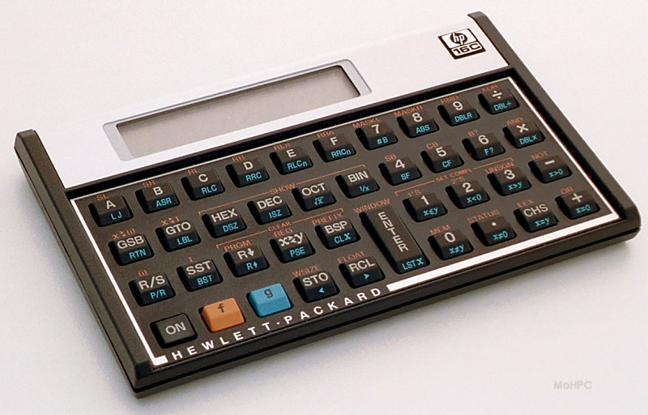
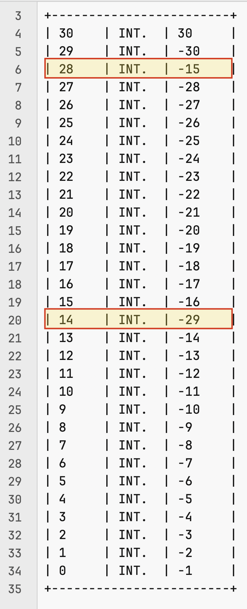

# ddForth

A modern Forth tailored for my needs – IoT and command-line scripting.

* [Background](##background)
* [How does that work?](#how-does-that-work)
	* [Numbers](#numbers)
	* [Strings](#strings)
* [Under the hood](#under-the-hood)
* [Heterogenous but unified stack](#heterogenous-but-unified-stack)
* [Stack Operations in the wild!](#stack-operations-in-the-wild)
* [Recursive user words](#recursive-user-words)
* [Control flow statement](#control-flow-statement)
* [Strings](#strings)
* [Numbers and maths](#numbers-and-maths)
* [Perfect segue variables!](#perfect-segue-variables!)
* [U(ART|SB)](#uartsb)
* [Keyboard, files & automatic execution](#keyboard-files--automatic-execution)

## Background

I started with Forth around 1982/3 – memory's a bit fuzzy by now... Anyway, 40+ years ago. It's actually my third language, after 6800/6809 ASM and Microsoft BASIC. I was, and still am, fascinated by this language, because it felt/feels so alien – [RPN](https://www.hpmuseum.org/rpn.htm)🔗 is indeed a bit alien to normal human beings. At the same time, RPN calculators like the HP-12C and especially the [HP-16C](https://www.hpmuseum.org/hp16.htm)🔗 were considered to be the Rolls Royce of calculators.



So poor students like us, who couldn't buy an HP calculator, played with RPN on a computer with a Forth interpreter. And Forth, even on smaller 8-bit computers, had more than 203 bytes of RAM, so we could actually write useful(ish) programs.

While the craze faded – at least for me – it never really disappeared, and over the next 4 decades I wrote a few half-assed implementations, some of which were trying to be Forth-79 conforming, others, more ad-hoc. But I never went very far. And I had a job, and and and...

Not anymore, Buster. Well, I have two jobs, but I also have a much more relaxed approach to life, so recently I started a new implementation. At first, just to test the waters. I decided to do it in C++ this time, betting on the balance between ease of use and the powerful traits of the language. It turned out to be a good choice. The first iterations went so well that I found myself, before I knew it, with something that actually worked – not well yet, but it was indeed usable...

I was using a 1983 French book by Mr Pinault, based on Forth-79. While I deviated from the standard after a while, and picked what I wanted from it, while ignoring other stuff, and adding my own words, I have now something that looks and feels like Forth, with original parts, and a few modern bits.

## How does that work?

Let's have a look at a few simple examples – suggested by Jaypee:

### Numbers

```
OK 1 2 3 .S

+-----------------------+
| 0	| INT.	| 3	|
| 1	| INT.	| 2	|
| 2	| INT.	| 1	|
+-----------------------+
OK * +
OK .
7 OK 
```

The user enters `1 2 3`, which stacks 1, then 2, then 3. 3 is thus on top of the stack, as shown by `.S`.

`* +` is interpreted in that order, `*` first: 2 * 3, which removes 3 and 2, and puts 6 on the stack, then `+`: 1 + 6, finally putting 7 on the stack. Remember, operations that "touch" the stack affect it. (Things like `PICK` do not affect the state of the stack, but they're exceptions.)

You can do the same with floats:

```
OK 3.14 5.0 2.0 .S *  * .

+-----------------------+
| 0	| FLOAT	| 2.000	|
| 1	| FLOAT	| 5.000	|
| 2	| FLOAT	| 3.140	|
+-----------------------+
31.400002 OK 
```

The slight "mistake", 31.400002 instead of 31.4, is due to how computers store floats. A common problem. Let's see what happens when we use the `PI` constant.

```
OK PI
OK .S

+-----------------------+
| 0	| INT.	| 384	|
+-----------------------+
OK 
```

Whatta...? This is one of the first things that trip programmers coming from other languages. Variables and constants are memory cells, and calling them puts their address on the stack. That's how you read from AND write to them.

The keyword to read from is `@`, and you use `!` to write. You can't write to `PI`, though, as it is a constant. So, to get PI on the stack you do:

```
OK PI ?
3.141593 OK 
OK PI @ 5.0 2.0 * * .
31.415928 OK 
```

A useful keyword is `?`, which is a user command I added in the default set of commands, which evaluates to `@ .`. See the `WORDS` command:

```
[...]
User Commands:
--------------
 • 0=          0 =
 • 0>          0 >
 • 0<          0 <
 • TRUE        1 =
 • FALSE       0 =
 • ?           @ .
[...]
```

This works with floats and integers:

```
OK PI @ 3 * . CR
( CR means carriage return, and yes this is a comment )
9.424778
OK
```

Let's create a user word that calculates the length of a circle:

```
OK : circleWithRadius ( r -- length ) 2.0 * PI @ * ;
OK 5.0 circleWithRadius . CR
31.415928
OK 
```

Here `2.0` is not necessary, but slightly faster: homogenous calculations are evaluated first. `2` would work just as well, just slightly slower – although on a modern computer the difference is not relevant.

### Strings

ddForth is intended to be great with strings. It isn't yet, but I'll try very hard :-) First, to stack a string, you must tell Forth that's what you want to do: without a keyword to say "please stack this as a string" something like "this is a string" would be interpreted as `"this`, `is`, `a`, `string"`. We do not want that. I modeled this on `." print this string"` and called it `s"`:

```
OK s" this is a string"
OK .S

+-----------------------+
| 0	| STR.	| `this is a string`	|

+-----------------------+
OK 
```

So, what can we do with that? In [Strings](#strings) you'll see the list of commands. But let's try a quick example:

```
OK clear s" Player3 Player2 Player1" SSPLIT
OK .S

+-------------------------------+
| 0	| INT.	| 3		|
| 1	| STR.	| `Player1`	|
| 2	| STR.	| `Player2`	|
| 3	| STR.	| `Player3`	|
+-------------------------------+
OK
```

The `SSPLIT` keyword is a user command that leaves on top of the stack the number of chunks. It is evaluated to `32 csplit`:

```
OK help" ssplit"
Looking for SSPLIT
ssplit          32 csplit
OK 
```

(See how the `help"` command works like `."` and `s"`? Very helpful. No pun intended...) Now that we have three strings on the stack, we could store them in a `VARRAY` named "Players", for example:

```
OK s" Players" VARRAY
OK .S
Stack empty!
OK arrays
Integer arrays: 0
Float arrays: 0
String arrays: 1
* Players
OK s" Players" alist
Cell #0: Player1
Cell #1: Player2
Cell #2: Player3
OK 
```

`VARRAY` takes the name of the array, then the number on top of the stack (or fails loudly!), then checks there are indeed 3 strings, then creates the array, if it doesn't exist, or again complains. Let's look at a common mistake – speaking, ahem, from experience here:

```
OK clear s" Player3 Player2 Player1" SSPLIT
OK . ( this is a mistake! )
3 OK s" Players" VARRAY
handleVARRAY/1 Stack overflow!
VARRAY returned false. Aborting!

CONTEXT: 0 to 3
        s" Players" VARRAY         

+-----------------------+
| 0	| STR.	| `Player1`	|
| 1	| STR.	| `Player2`	|
| 2	| STR.	| `Player3`	|
+-----------------------+
OK 
```
Printing `3` with the `.` command consumed 3 – so now `VARRAY` cannot find a row count, and bails. If you wanted to display the number of rows without breaking, you add `DUP` before `.`:

```
OK clear s" Player3 Player2 Player1" SSPLIT
OK DUP . CR
3
OK s" Players" VARRAY
OK s" Players" ALIST 
Cell #0: Player1
Cell #1: Player2
Cell #2: Player3
OK 
```

And once you have a bunch of rows, you can of course join them again into one string:

```
OK clear s" Player3 Player2 Player1" SSPLIT
OK .S

+-----------------------+
| 0	| INT.	| 3	|
| 1	| STR.	| `Player1`	|
| 2	| STR.	| `Player2`	|
| 3	| STR.	| `Player3`	|
+-----------------------+
OK s" ;" strjoin
OK cs CR
Player3;Player2;Player1
OK 
```

## Under the hood

### Heterogenous, but Unified, Stack

Initially, Forth was integer numbers only. It was a bit limiting, but it's not like I was doing floating maths in 6809 ASM either. Over the years, my implementations tried to add floats. Today, ddForth accepts floats, integers and strings on the stack, and, so far so good, doesn't seem to mind.

As we saw above, the `SSPLIT` command leaves on top of the stack the number of chunks. This is achieved by maintaining **FOUR** stacks separately, one for each type, but a fourth one that records the type of each element in the virtual unified stack. The native words supplied in ddForth know what they need in terms of data types, and will complain, and fail, if they don't get what they want. So it's up to the user to keep a clean stack.

For example, with the stack as above, this is what happens if you call `cs`, display a string.

```
OK clear s" Player3 Player2 Player1" SSPLIT cs
handlePRINTSTACKSTRING Stack overflow!
cs returned false. Aborting!

CONTEXT: 2 to 5
        Player3 Player2 Player1" SSPLIT cs

+-------------------------------+
| 0	| INT.	| 3		|
| 1	| STR.	| `Player1`	|
| 2	| STR.	| `Player2`	|
| 3	| STR.	| `Player3`	|
+-------------------------------+
```

It displays a little context – 2 words before the culprit, two after, not so much here since cs is the last word – shows the stack and then cleans up (including nuking the stack).

Since one might want to unify data types to use the data together, words have been added to change the type: `INT`, `STRINT`, `STRFLOAT`, `INTSTR`, etc. Math operations on heterogenous types, ie INT/FLOAT, result in what is (I hope) the most logical result. Usually a FLOAT. Comparisons between INT and FLOAT are regressed to and INT/INT comparison. This is not yet set in stone, but at least it provided a good foundation. The overall idea is to make the best of an environment that might provide data in different forms.

So the `.` command, which is traditionally for numbers only, works for strings too, whereas `cs` and `U.`, which are strictly for strings, and uints, respectively, will fail if given data of the wrong type.

```
OK 1 2.0 s" 3.3" .S

+-----------------------+
| 0	| STR.	| `3.3`	|
| 1	| FLOAT	| 2.000	|
| 2	| INT.	| 1	|
+-----------------------+
OK cr . cr . cr . cr

3.3
2.000000
1


OK 1 cs
handlePRINTSTACKSTRING Stack overflow!
cs returned false. Aborting!

CONTEXT: 0 to 2
        1 cs

+-----------------------+
| 0	| INT.	| 1	|
+-----------------------+
OK
```

**Main Stack Operations:**

* `DUP`: ( a -- a a ) Duplicates value on top of the stack.
* `DROP`: ( a -- ) Drops value on top of the stack.
* `SWAP`: ( a b -- b a ) Swaps the 2 values on top of the stack.
* `DEPTH`: ( a b c d... -- a b c d... x ) Puts the length of the stack on top of the stack.
* `CLEAR`: ( a b c d... -- ) Removes everything from the stack.
* `ROT`: (a b c -- c a b) Rotates the 3 values on top of the stack.
* `ROLL`: ( a b c d... u -- x y z t... ) Rotates u items. SWAP = 1 ROLL. ROT = 2 ROLL
* `OVER`: ( a b -- a b a) Place a copy of a on top of the stack.
* `STRPICK`: ( s0 s s2 s3... n x -- s0 s s2 s3... n sx ) Copies string x among the n strings on top of the stack.
* `STRSTORE`: ( s0 s s2 s3... n S x -- s0 s s2 s3... n ) Takes string S and stores it at index x.
* `STRJOIN`: ( s0 s s2 s3... n S -- s ) Joins strings on stack with S.
* `PICK`: ( a b c d e f... n -- x ) Copies element n as x on top of the stack.
* `!`: ( ad a -- ) Stores a into variable at address ad. myvar 10 !
* `!+`: ( ad -- ) Increments variable at address ad. myvar +!
* `@`: ( ad -- ) Puts contents of variable at address ad on top of the stack. myvar @
* `.S`: ( -- ) Displays the stack.

### Stack Operations in the wild!

Here is code that exchanges the contents of two cells on the stack. Say we have 30 numbers on the stack, with that count on top:

```
30 0 DO i -1 * 1 - LOOP 30 .S

+------------------------+
| 30   	| INT. 	| 30     |
| 29   	| INT. 	| -30    |
| 28   	| INT. 	| -29    |
| 27   	| INT. 	| -28    |
| 26   	| INT. 	| -27    |
| 25   	| INT. 	| -26    |
| 24   	| INT. 	| -25    |
| 23   	| INT. 	| -24    |
| 22   	| INT. 	| -23    |
| 21   	| INT. 	| -22    |
| 20   	| INT. 	| -21    |
| 19   	| INT. 	| -20    |
| 18   	| INT. 	| -19    |
| 17   	| INT. 	| -18    |
| 16   	| INT. 	| -17    |
| 15   	| INT. 	| -16    |
| 14   	| INT. 	| -15    |
| 13   	| INT. 	| -14    |
| 12   	| INT. 	| -13    |
| 11   	| INT. 	| -12    |
| 10   	| INT. 	| -11    |
| 9    	| INT. 	| -10    |
| 8    	| INT. 	| -9     |
| 7    	| INT. 	| -8     |
| 6    	| INT. 	| -7     |
| 5    	| INT. 	| -6     |
| 4    	| INT. 	| -5     |
| 3    	| INT. 	| -4     |
| 2    	| INT. 	| -3     |
| 1    	| INT. 	| -2     |
| 0    	| INT. 	| -1     |
+------------------------+
```
Having the values as negative numbers will help when Looking at the stack: positives numbers = index (or count), negative numbers = values.

We need to generate 2 random numbers between 0 and (count - 1). Which is achieved by `RANDOM <count> MOD`. So we need to get a fresh copy of `30`, and put it over the random number.

```
DUP 
+--------------------------------------------------------+
| 31       | INT.     | 30 The count is duplicated       |
| 30       | INT.     | 30                               |
| 29       | INT.     | -30                              |
[...]
+--------------------------------------------------------+
random 
+--------------------------------------------------------+
| 32       | INT.     | 88 Random number                 |
| 31       | INT.     | 30                               |
| 30       | INT.     | 30                               |
| 29       | INT.     | -30                              |
+--------------------------------------------------------+
swap 
+--------------------------------------------------------+
| 32       | INT.     | 30 MOD needs the limit on top    |
| 31       | INT.     | 88                               |
| 30       | INT.     | 30                               |
| 29       | INT.     | -30                              |
+--------------------------------------------------------+
mod 
+--------------------------------------------------------+
| 31       | INT.     | 28 Result of 88 % 30: cell 28    |
| 30       | INT.     | 30                               |
| 29       | INT.     | -30                              |
+--------------------------------------------------------+
```
In order to proceed with a second round of random number generation, we need to bring the count on top:

```
swap 
+--------------------------------------------------------------+
| 31       | INT.     | 30 Put the number of cells back on top |
| 30       | INT.     | 28                                     |
| 29       | INT.     | -30                                    |
+--------------------------------------------------------------+
```
So now we can do again `DUP RANDOM SWAP MOD` and we now have 2 random numbers.

```
+--------------------------------------------------------+
| 32       | INT.     | 14 Result: cell 14               |
| 31       | INT.     | 30                               |
| 30       | INT.     | 28                               |
| 29       | INT.     | -30                              |
+--------------------------------------------------------+
```

So now we do to pick the values from these cells and store them back again, in reverse. This will involve:

* Keeping a copy of the indexes for the storage operation
* Rotating and swapping stuff around to position them properly.

`14 30 28` is not what we want right now. We want `30`, the count, at the bottom of the 3, so that we have easy access to the indexes:

```
rot 
+---------------------------------------------------------+
| 32       | INT.     | 30 rot works on the top 3 elements|
| 31       | INT.     | 28                                |
| 30       | INT.     | 14                                |
| 29       | INT.     | -30                               |
+---------------------------------------------------------+
rot 
+--------------------------------------------------------------+
| 32       | INT.     | 28 ROT x2 we have the 2 indexes on top |
| 31       | INT.     | 14                                     |
| 30       | INT.     | 30                                     |
| 29       | INT.     | -30                                    |
+--------------------------------------------------------------+
```
There we go, 28 and 14 on top. Now we pick cell 28's content, move things around, and pick cell 14's content.

```
dup 
+--------------------------------------------------------+
| 33       | INT.     | 28 Duplicate so we can use it    |
| 32       | INT.     | 28                               |
| 31       | INT.     | 14                               |
| 30       | INT.     | 30                               |
| 29       | INT.     | -30                              |
+--------------------------------------------------------+
pick 
+--------------------------------------------------------------+
| 33       | INT.     | -29 Replaces cell index with content   |
| 32       | INT.     | 28                                     |
| 31       | INT.     | 14                                     |
| 30       | INT.     | 30                                     |
| 29       | INT.     | -30                                    |
+--------------------------------------------------------------+
rot 
+--------------------------------------------------------+
| 33       | INT.     | 28                               |
| 32       | INT.     | 14                               |
| 31       | INT.     | -29                              |
| 30       | INT.     | 30                               |
+--------------------------------------------------------+
rot 
+--------------------------------------------------------------+
| 33       | INT.     | 14 ROT x 2 again to reposition elements|
| 32       | INT.     | -29                                    |
| 31       | INT.     | 28                                     |
| 30       | INT.     | 30                                     |
| 29       | INT.     | -30                                    |
+--------------------------------------------------------------+
```
We can now pick the second cell's value:

```
dup 
+--------------------------------------------------------+
| 34       | INT.     | 14 Duplicate so we can use it    |
| 33       | INT.     | 14                               |
| 32       | INT.     | -29                              |
| 31       | INT.     | 28                               |
| 30       | INT.     | 30                               |
+--------------------------------------------------------+
pick 
+--------------------------------------------------------------+
| 34       | INT.     | -15 Replaces cell index with content   |
| 33       | INT.     | 14                                     |
| 32       | INT.     | -29                                    |
| 31       | INT.     | 28                                     |
| 30       | INT.     | 30                                     |
| 29       | INT.     | -30                                    |
+--------------------------------------------------------------+
```
The last task is to reposition values so that they are for each other's index.

```
rot 
+--------------------------------------------------------------+
| 34       | INT.     | 14  We want to position the contents   |
| 33       | INT.     | -29 with the opposite cell indexes     |
| 32       | INT.     | -15                                    |
| 31       | INT.     | 28                                     |
| 30       | INT.     | 30                                     |
| 29       | INT.     | -30                                    |
+--------------------------------------------------------------+
```
Magically, one `ROT` is all we need. `PLACE` needs `( value address -- )` so they're properly positioned too.

```
place 
+--------------------------------+
| 32       | INT.     | -15      |
| 31       | INT.     | 28       |
| 30       | INT.     | 30       |
| 29       | INT.     | -30      |
+--------------------------------+
```
The second set is in reverse, we need to swap them first:

```
swap 
+------------------------------------------------+
| 32       | INT.     | 28                       |
| 31       | INT.     | -15                      |
| 30       | INT.     | 30                       |
| 29       | INT.     | -30                      |
+--------------------------------------------------------------+
place
+------------------------------------------------+
| 30       | INT.     | 30                       |
| 29       | INT.     | -30                      |
| 28       | INT.     | -15                      |
| 27       | INT.     | -28                      |
+------------------------------------------------+
```



So you can run this a bunch of times and you will get a deck of cards pretty well shuffled. And store that in a `VARRAY` for example.

```
30 0 DO i -1 * 1 - LOOP 30 .S

: shuffle DUP random swap mod swap DUP random swap mod rot rot dup pick rot rot dup pick rot place swap place ;

1000 0 do shuffle loop s" MyArray" VARRAY
s" MyArray" DUP LEN> 0 DO
  ." Cell " DUP I I . ." = " swap IX> . CR
loop

Cell 0 = -9 
Cell 1 = -30 
Cell 2 = -23 
Cell 3 = -6 
Cell 4 = -4 
Cell 5 = -26 
Cell 6 = -13 
Cell 7 = -25 
Cell 8 = -11 
Cell 9 = -12 
Cell 10 = -3 
Cell 11 = -16 
Cell 12 = -10 
Cell 13 = -22 
Cell 14 = -15 
Cell 15 = -7 
Cell 16 = -2 
Cell 17 = -1 
Cell 18 = -24 
Cell 19 = -29 
Cell 20 = -18 
Cell 21 = -17 
Cell 22 = -8 
Cell 23 = -27 
Cell 24 = -21 
Cell 25 = -14 
Cell 26 = -19 
Cell 27 = -28 
Cell 28 = -20 
Cell 29 = -5 
```

Speed tests with 100 and 10,000 shuffles:

OK ddforth -e tests/test32.fs  0.03s user 0.05s system 96% cpu 0.081 total
OK ddforth -e tests/test32.fs  0.22s user 0.30s system 99% cpu 0.519 total


### Recursive user words

User-defined words are built following this syntax:

`: <name> word word word ... ;`

In the standard a not-yet finished word cannot call itself. The way I implemented it means you can – and should! I put in early a C++ native `fact` word, but I wanted to see how hard it would be to do it the Forth way, with a custom user word calling itself, which isn't standard, but oh so useful. As you can see if works pretty well...


```
% ddforth -f tests/test16.fs
ddForth v1.2.0
 • Read: : fx DUP 1 >  IF DUP 1 - fx * THEN ELSE ;
 • Read: 12 3 DO I fx . LOOP CR
 • Read: 12 1 DO
 • Read:   s" ." I' I 1 + - MULTSTR cs
 • Read:   I DUP INTSTR cs ." ! = " fx . CR
 • Read: LOOP CR
Read: 6 lines, chunks: 45
6 24 120 720 5040 40320 362880 3628800 39916800
..........1! = 1
.........2! = 2
........3! = 6
.......4! = 24
......5! = 120
.....6! = 720
....7! = 5040
...8! = 40320
..9! = 362880
.10! = 3628800
11! = 39916800
```

Due to the fact that ddForth uses C++ standard `int`, the `fact` word and the `fx` custom word will hit a wall quickly:

```
OK 30 begin 1 + dup dup . fact dup U. cr 0 = until clear
31 738197504
32 2147483648
33 2147483648
34 0
OK
```

### Control Flow Statement

[DO...LOOP](https://www.forth.com/starting-forth/6-forth-do-loops/)🔗 is a very common way in Forth to do loops (HENCE THE NAME!). Searching for DO.LLOP will usually give you a Forth-related link towards the top.

```
% ddforth -f tests/test11.fs
ddForth v1.2.0
 • Read: CR 5 0 DO
 • Read:   I . 5 0
 • Read:   DO
 • Read:     I .
 • Read:   LOOP
 • Read:   CR
 • Read: LOOP
Read: 7 lines, chunks: 14

0 0 1 2 3 4
1 0 1 2 3 4
2 0 1 2 3 4
3 0 1 2 3 4
4 0 1 2 3 4

OK
```

And good news! Imbricated DO...LOOP statements work. Bit of an accident, but I am not going to complain! Other methods include:

* *condition* `IF...THEN...ELSE`

  These cannot be imbricated.

* `BEGIN` *condition* `UNTIL/WHILE`

  I haven't tried it much but from the way I implemented it, `BEGIN` statements could be imbricated.

### STRINGS

One important use case for me is string manipulations. At some point I might add a PCRE regex engine, but in the meantime I added a few string manipulation functions.

* `CSPLIT`: ( s t -- a b c d...) Splits string s by delimiter t (one ASCII char) and puts the result on the stack.
* `SPLITD`: ( s t -- a b c d...) Splits string s by delimiter t (a string) and puts the result on the stack.
* `DINSERT`: ( s1 s0 n -- s ) Inserts s0 into s1 every n chars.
* `STRREPLACE`: ( s0 s1 s2 -- s ) Replaces instances of s1 by s2 in s0.
* `MULTSTR`: ( s a -- x ) Puts a string that's a times string s on the stack. `s" A" 6 MULTSTR` ==> AAAAAA
* `SREVERSE`: ( s0 s1 s2 s3 s4... n -- sx... s4 s3 s2 s1 n ) Reverses a stack of strings prefixed by count.
* `+STR`: ( a b -- ba ) Prepends string b to string a. AA BB +STR ===> BBAA
* `STR+`: ( a b -- ab ) Appends string b to string a. AA BB STR+ ===> AABB
----
* `INTSTR`: ( a -- x ) Converts int to str.
* `STRFLOAT`: ( a -- x ) Converts str to float.
* `STRINT`: ( a -- x ) Converts str to int.
----
* `LENSTR`: ( a -- a x ) Puts length of string a on top of the stack.
* `LEFTSTR`: ( a -- a x ) Puts the leftmost char of string a on top of the stack.
* `MIDSTR`: ( a b -- a x ) Puts the bth char of string a on top of the stack.
* `RIGHTSTR`: ( a -- a x ) Puts the rightmost char of the string on top of the stack.
* `SUBSTR`: ( s a b -- s x ) Puts substring(a, b) of string s on top of the stack.
----
* `STRIPSTR`: ( a -- x ) Removes whitespaces on both sides of string a
* `LSTRIPSTR`: ( a -- x ) Removes whitespaces on the left side of string a
* `RSTRIPSTR`: ( a -- x ) Removes whitespaces on the right side of string a
----
* `UPPERSTR`: ( a -- A ) replaces string a with its uppercase version
* `LOWERSTR`: ( A -- a ) replaces string A with its lowercase version
----
* `STRPICK`: ( s0 s s2 s3... n x -- s0 s s2 s3... n sx ) Copies string x among the n strings on top of the stack.
* `STRSTORE`: ( s0 s s2 s3... n S x -- s0 s s2 s3... n ) Takes string S and stores it at index x.
* `STRJOIN`: ( s0 s s2 s3... n S -- s ) Joins strings on stack with S.
* `PICK`: ( a b c d e f... n -- x ) Copies element n as x on top of the stack.

The last one is not a string-specific function, but comes in handy. Here's a pure Forth implementation of `strreplace`.

```forth
OK CR s" Hi, my name is Lokesh. Lokesh means King of the World." DUP cs CR CR
s" " splitd DUP 0 DO
  I pick s" e" S=
  IF
    s" 3" I strstore
  THEN
  ELSE
LOOP
s" " strjoin cs CR

Hi, my name is Lokesh. Lokesh means King of the World.

Hi, my nam3 is Lok3sh. Lok3sh m3ans King of th3 World.
OK
```

Case-sensitive, and ASCII only, but it works! Note that there is a tricky situation in that double loop: `I` and `I'` stand for the current index and limit of the inner loop (when imbricated), and `J` is for the outside loop. However I am using `I` in both cases: that's because when the execution pointer is in the outside loop, but not in the inside loop, there's only one loop so far, so `I` is indeed correct. If I however wanted to access the outside loop index from within the inside loop then `J` would be the correct word.

```
OK 5 0 do 5 0 do J . I 2 * . CR loop loop cr
0 0
0 2
0 4
0 6
0 8
1 0
1 2
1 4
1 6
1 8
2 0
2 2
2 4
2 6
2 8
3 0
3 2
3 4
3 6
3 8
4 0
4 2
4 4
4 6
4 8

OK
```

The equivalent with two `I` words would be:

```
OK 5 0 do I 5 0 do DUP . I 2 * . CR loop drop loop cr
0 0
0 2
0 4
0 6
0 8
1 0
1 2
1 4
1 6
1 8
2 0
2 2
2 4
2 6
2 8
3 0
3 2
3 4
3 6
3 8
4 0
4 2
4 4
4 6
4 8

OK
```

### Numbers and Maths

There are quite a few operators:

* `BASE`: ( a -- ) Sets the base
* `BIN`: ( -- ) Sets the base to binary
* `DEC`: ( -- ) Sets the base to decimal
* `HEX`: ( -- ) Sets the base to hexadecimal
* `-`: ( a b -- x ) Puts a-b on top of the stack.
* `*`: ( a b -- x ) Puts a*b on top of the stack.
* `/`: ( a b -- x ) Puts a/b on top of the stack.
* `+`: ( a b -- x ) Puts a+b on top of the stack.
* `ABS`: ( a -- x ) Puts absolute value of A on top of the stack.
* `ACOS`: ( a -- x ) Puts acos(a) on top of the stack.
* `AND`: ( a b -- x ) Puts a&b on top of the stack.
* `ASIN`: ( a -- x ) Puts asin(a) on top of the stack.
* `ATAN`: ( a -- x ) Puts atan(a) on top of the stack.
* `CEIL`: ( a -- x ) Puts ceil(a) on top of the stack.
* `COS`: ( a -- x ) Puts cos(a) on top of the stack.
* `COSH`: ( a -- x ) Puts cosch(a) on top of the stack.
* `EXP`: ( a -- x ) Computes e raised to power a
* `FACT`: ( a -- x ) Puts a! on top of the stack.
* `FLOOR`: ( a -- x ) Puts floor(a) on top of the stack.
* `INT`: ( a -- x ) Converts a to an integer
* `INVERT`: ( a -- x ) Puts ~a on top of the stack.
* `LOG`: ( a -- x ) Puts log(a) on top of the stack.
* `LOG10`: ( a -- x ) Puts log10(a) on top of the stack.
* `MAX`: ( a b -- x ) Puts max(a,b) on top of the stack.
* `MIN`: ( a b -- x ) Puts min(a,b) on top of the stack.
* `MOD`: ( a b -- x ) Puts a%b on top of the stack.
* `NEGATE`: ( a -- x ) Puts ((~a) + 1) on top of the stack.
* `NOT`: ( a -- x ) Puts (1 - (a&1)) on top of the stack.
* `OR`: ( a b -- x ) Puts a|b on top of the stack.
* `ROUND`: ( a -- x ) Puts round(a) on top of the stack.
* `SIN`: ( a -- x ) Puts sin(a) on top of the stack.
* `SINH`: ( a -- x ) Puts sinch(a) on top of the stack.
* `SQR`: ( a -- x ) Puts (a*a) on top of the stack.
* `SQRT`: ( a -- x ) Puts √a on top of the stack.
* `TAN`: ( a -- x ) Puts tan(a) on top of the stack.
* `TANH`: ( a -- x ) Puts tanch(a) on top of the stack.
* `XOR`: ( a b -- x ) Puts a^b on top of the stack.

One of the cool toys of Forth is that it handles (integer) numbers in whatever base you want, internally, via the `BASE` variable. This is something that always fascinated me as a kid, back when I was fluent in binary and especially hexadecimal. I believe I have properly implemented this, and it seems to work:


```
OK base 36 ! 10 dec . CR
36
OK
```

Remember, whatever base you are currently using, `10` will be equal to the base: 10 in decimal, 2 in binary, 16 in hexadecimal, etc. Forth accepts any number for the base (as a kid I would type in words, having set `BASE` to 36, and would print out the numbers in decimal, haha, so much fun!). In ddForth, I thought of limiting the base to 16. Hey, fuggit, let's go 36 too. My name makes for a big number!

### Perfect segue: variables!

You'd think Forth, with its all-powerful stack, wouldn't need variables. But it does. And I have implemented both the mainstream variable, plus a couple of twists. First, variables can be of any of the 3 types. And, like this wasn't enough, I added constants. Makes for nice error messages! :-)

Then you have `ARRAY` and `VARRAY`, named arrays 

* `ARRAY`: ( a b name -- ) Creates array name with b rows containing a.
* `ARRAYS`: ( -- ) Lists existing arrays by type.
* `>IX`: ( a b name -- ) Stores a into row b of array name.
* `IX>`: ( a name -- b ) Puts contents of row a of array name on top of the stack.
* `LEN>`: ( name -- a ) Puts length of array name on top of the stack.
* `IX+`: ( a name -- ) Appends a to array name.
* `+IX`: ( a name -- ) Prepends a to array name.
* `<ROT`: ( name -- ) Rotates up array name.
* `ROT>`: ( name -- ) Rotates down array name.
* `ALIST`: ( name -- ) List of arrays.
* `ASUM`: ( name -- a ) Puts the sum of all elements of array name on top of the stack.
* `VARRAY`: ( a b c d... num name -- ) Creates an array with data a, b, c, d etc, making sure there are num data pieces
* `.V`: ( -- ) Shows existing vars by type

```
OK .V 

+-----------------------------------------+
| Num     |  VAR Name   | Addr | Value    |
+-----------------------------------------+
|   0/2   | BASE        |    0 |       10 |
|   1/2   | VER.        |    1 |     1200 |
+-----------------------------------------+
+-----------------------------------------+
| Num     | FCONST Name | Addr | Value    |
+-----------------------------------------+
|   0/2   | E           |  385 | 2.718282 |
|   1/2   | PI          |  384 | 3.141593 |
+-----------------------------------------+
OK 
```

**ARRAY**

```
OK -1 13 s" tagada" array arrays
Integer arrays: 1
* tagada
Float arrays: 0
String arrays: 0
OK

s" tagada" alist
Cell #0: -1
Cell #1: -1
Cell #2: -1
Cell #3: -1
Cell #4: -1
Cell #5: -1
Cell #6: -1
Cell #7: -1
Cell #8: -1
Cell #9: -1
Cell #10: -1
Cell #11: -1
Cell #12: -1
OK 
```

The array is initialized with the same value, and you can then access and modify individual values with `>IX` and `IX>`, adding to the array with `+IX` and `IX+`. Also, `<ROT` and `ROT>` rotate the cells inside an array.

```
───────┬────────────────────────────────────────────────────────────────────────────────
       │ File: tests/test23.fs
───────┼────────────────────────────────────────────────────────────────────────────────
   1   │ clear ." Split `"
   2   │ s" 1"
   3   │ 100 0 DO
   4   │   RANDOM 10 MOD INTSTR
   5   │   DUP cs
   6   │   STR+
   7   │ LOOP
   8   │ ." ` by: "
   9   │ RANDOM 10 MOD
  10   │ DUP .
  11   │ INTSTR
  12   │ SPLITD
  13   │ CR DUP ." Pieces: " . CR
  14   │ 0 DO
  15   │   ." * " cs cr
  16   │ LOOP
  17   │ 
  18   │ 1 2 3 4 4 s" ints" VARRAY CR s" ints" alist
  19   │ 1.1 2.2 3.3 4.4 4 s" floats" VARRAY CR s" floats" alist
  20   │ s" un|deux|trois|quatre" s" |" SPLITD s" strings" VARRAY CR s" strings" alist
───────┴────────────────────────────────────────────────────────────────────────────────

% ./bin/ddforth -f tests/test23.fs
ddForth v1.2.0
Split `3680019771338394912334474796760171273476774698014389735896931227864906843041302037822580802491737350` by: 0 
Pieces: 12 
* 
* 249173735
* 8
* 3782258
* 2
* 413
* 6843
* 143897358969312278649
* 171273476774698
* 1977133839491233447479676
* 
* 1368

Cell #0: 4
Cell #1: 3
Cell #2: 2
Cell #3: 1

Cell #0: 4.400000
Cell #1: 3.300000
Cell #2: 2.200000
Cell #3: 1.100000

Cell #0: quatre
Cell #1: trois
Cell #2: deux
Cell #3: un
OK
```

This example demonstrates a few features together, including string functions like `SPLITD` and `STR+`, `VARRAY` and `RANDOM`, which produces random bytes (`RANDOMI` produces INTs).

In [test32](tests/test32.fs) we show how VARRAYs can be sorted up/downwards. 

```
." SORT\n=========\n"
s" MyArray" SORTV
s" MyArray" DUP LEN> 0 DO
  ." Cell " DUP I I . ." = " swap IX> . CR
loop

." REVERSE SORT\n=========\n"
s" MyArray" RSORTV
s" MyArray" DUP LEN> 0 DO
  ." Cell " DUP I I . ." = " swap IX> . CR
loop
```

And of course, once you have your data in a VARRAY, you might want to find it, especially after a few hundred shuffles:

```
OK 0 1 2 3 4 5 6 7 8 9 10 s" vv" varray
OK 0 s" vv" findv
OK .s

+-------------------------------+
| 1        | INT.     | 1       |
| 0        | INT.     | 9       |
+-------------------------------+

OK IF ." Found at position " . then ." Not found!" else CR
Found at position 9
OK
```
`FINDV` puts `TRUE` (1) or `FALSE` (0) on top of the stack, and below, if TRUE, the index.

### U(ART|SB)

I need to be able to talk to external devices (current use cases are GPS and UWB modules). So here we go:

* `UOPEN`: ( 9600 s" /dev/tty.usb..." -- n ) Open ports at designated baud rate. Puts TRUE/FALSE on top of the stack.
* `UREADL`: ( -- s ) Reads a line from port.
* `UREADRAW`: ( n -- s ) Reads x bytes from port and puts them as a string on the stack.
* `UFLUSH`: ( -- s ) Flushes the port.
* `UINQ`: ( -- n ) Puts on the stack how many bytes are available on the port.
* `UDISCARDUNTIL`: ( s -- ) Reads and discards from port until s.
* `UREADUNTIL`: ( s -- ) Reads from port until s.
* `UREADC`: ( -- c ) Reads one byte from serial port.
* `UCLOSE`: ( -- ) Closes the port.
* `UWRITE`: ( s -- ) Writes string s to the port.

### Keyboard, Files & automatic execution

* `EMIT`: ( a -- ) printf(\"%c\", a);
* `CHR`: ( a -- s ) Converts an ASCII code to a string and puts it on the stack.
* `KEY`: ( -- x) Waits for a key and puts it on the stack.
* `LINE`: ( -- x ) Waits for a line, and puts it on the stack.
* `EXEC`: ( s -- ?) Executes string on the stack. Can be used in conjunction with LINE.
* `FLOAD`: ( s -- ?) Loads file named 'name' and executes it.
* `FSAVE`: ( cd fn -- ?) Saves string cd to file 'fn'.

This is nowhere near finished, but it should give you enough to start poking around.

### Compiling

There is a Makefile that supplies options, and seems to work well. I have added an option, `small`, which uses `-Oz`. The current size savings of `ddforth_z` aren't bad, about 12% vs `ddforth`:

```
**292392**  6 Oct 10:52 ddforth
308896  6 Oct 10:52 ddforth_debug
334008  6 Oct 10:52 ddforth_SDL
350528  6 Oct 10:52 ddforth_SDL_debug
**257656**  6 Oct 10:52 ddforth_z
```
Speed-wise, the impact isn't too bad, a little higher: 15%. So if you're looking to compile a binary for a smaller device, `make small` is your friend.

```
50000 shuffles
OK ./bin/ddforth -e tests/test32.fs  1.07s user 1.41s system 94% cpu 2.622 total
OK ./bin/ddforth_z -e tests/test32.fs  1.34s user 1.42s system 89% cpu 3.067 total
```


VAZY TITI !!!