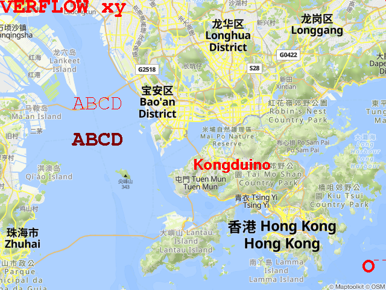

# PLUGINS Extra Steps

Do this before making the main project

## lodepng

```
git clone https://github.com/lvandeve/lodepng
cd lodepng
make
```

plugin.hpp uses `lodepng.o`.

## Adafruit-GFX

```
git clone https://github.com/adafruit/Adafruit-GFX-Library
```

### In each font file:

* Comment out #include <Adafruit_GFX.h>:

```
//#include <Adafruit_GFX.h>
```

* Comment out PROGMEM:

```
const uint8_t FreeMono...Bitmaps[] /* PROGMEM */ = {

const GFXglyph FreeMono...Glyphs[] /* PROGMEM */ = {
```

traversin.cpp uses fonts. Here's how:

```
#include "Adafruit-GFX-Library/gfxfont.h"
// Include the fonts you want
// comment out #include <Adafruit_GFX.h>
// Remove ` PROGMEM`
#include "Adafruit-GFX-Library/Fonts/FreeMono18pt7b.h"
#include "Adafruit-GFX-Library/Fonts/FreeMonoBold18pt7b.h"
#include "Adafruit-GFX-Library/Fonts/FreeSansBold12pt7b.h"

```

The `handleInit` method is compulsory in any plugin, and will be called when loading the plugin. In `handleInit`, traversin makes sure they are listed and usable:

```
  // Map the fonts that are being used.
  myFonts["FreeMono18pt7b"] = FreeMono18pt7b;
  cout << "\t• FreeMono18pt7b" << endl;
  myFonts["FreeMonoBold18pt7b"] = FreeMonoBold18pt7b;
  cout << "\t• FreeMonoBold18pt7b" << endl;
  myFonts["FreeSansBold12pt7b"] = FreeSansBold12pt7b;
  cout << "\t• FreeSansBold12pt7b" << endl;
  myFonts["FreeSans12pt7b"] = FreeSans12pt7b;
  cout << "\t• FreeSans12pt7b" << endl;
  return true;
}
```

This has to be done manually for the moment. Other plugins could use the same strategy.

Run `test43` first (after getting and setting an API key, see [test43.md](../tests/test43.md)). It'll get you a `map.png` image. The next 2 tests use it. Just in case I put a copy in [assets](../assets/).

